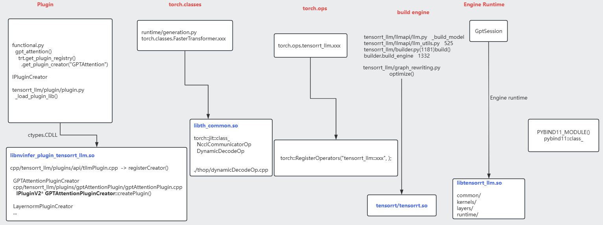

# Tensorrt-llm

### code

### Opt
Kernel fusion    
     sliding window attention + cyclic (rolling buffer) kv cache    
     alibi :  Attention(Q,K,V)=softmax((QKT/sqrt(d))+bias)V    bias[i][j]=−α∗(i−j)（i是query位置，j是key位置）    
Quantization    
     fp8    
Runtime optimizations like     
     c++ implementations,     
     kv cache,   offloading to host memory    
     continuous in-flight batching,     
     paged attention    
multi-gpu, multi-node    
Speculative sampling  

### Notes
gpt_attention    
   functional.py    
    attn_plug = attn_plg_creator.create_plugin("causal_attn", pfc)   
    layer = default_trtnet().add_plugin_v2(plug_inputs, attn_plug)      

TensorRT-LLM/cpp/tensorrt_llm/plugins/api/tllmPlugin.cpp
          initTrtLlmPlugins()

Build from source
https://nvidia.github.io/TensorRT-LLM/installation/build-from-source-linux.html    

https://docs.nvidia.com/deeplearning/tensorrt/latest/inference-library/extending-custom-layers.html#adding-a-plugin-instance-to-a-tensorrt-network    
https://github.com/NVIDIA/TensorRT/tree/main/plugin#tensorrt-plugins    

/usr/local/lib/python3.10/dist-packages/tensorrt_llm/libs/    
0.7.1    
        libnvinfer_plugin_tensorrt_llm.so  libth_common.so    
0.21.0rc1    
    libdecoder_attention_0.so  libnvinfer_plugin_tensorrt_llm.so  libtensorrt_llm_ucx_wrapper.so  libdecoder_attention_1.so  libtensorrt_llm.so                 libth_common.so	  
