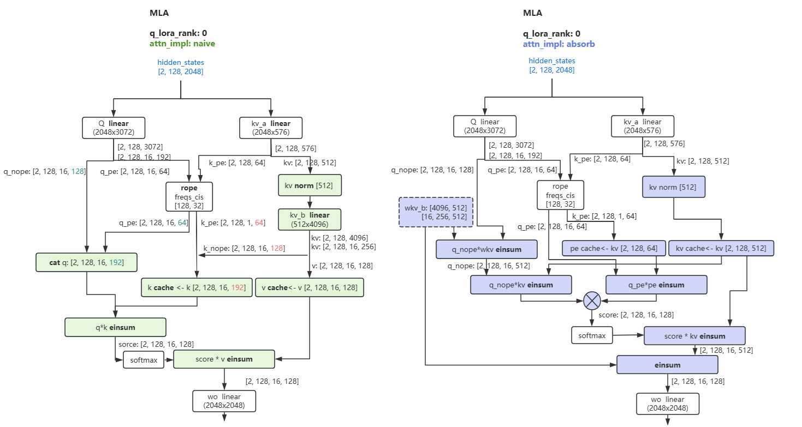
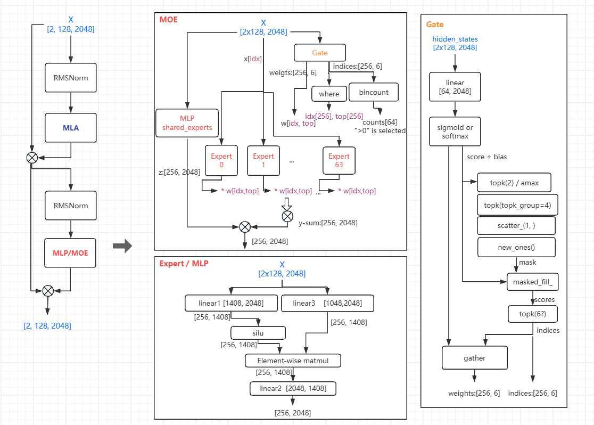
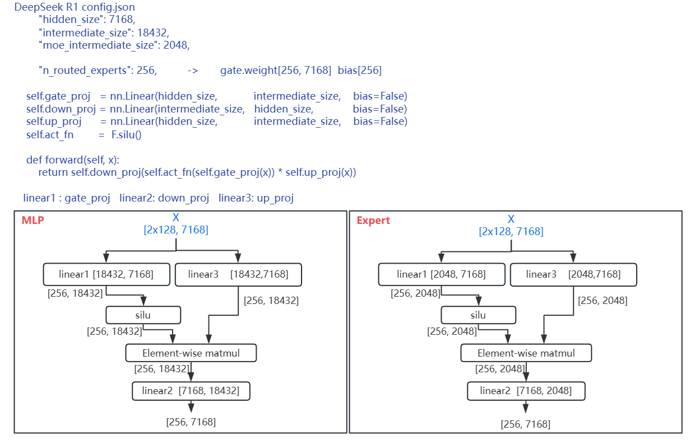

# Deepseek 

## 1. Run on CPU

```
docker run --rm -it -d --privileged -v /home/fengding/:/home/fengding intel/intel-extension-for-pytorch:2.4.0-pip-base

pip install triton==3.0.0
pip install transformers==4.46.3
pip install safetensors==0.4.5

python model.py
    output: torch.Size([2, 102400])
```

## 2. Deepseek MLA, naive vs absorb


## 3. Deepseek layer, moe


## 4. Deepseek R1 MLP, MOE



```
ep 实现就是：
	1. load model时候只 load ep_rank 对应的 experts
	2. 执行 moe 的时候，min_expert_id 和 max_exprt_id 也设置到 ep_rank 对应的区间
all_reduce 不需要修改，因为 moe下面本来就有一个all_reduce，在所有expert上apply的结果是 sum 起来的，所以用现有的all_reduce 数学上是没问题的

LLM weights_load_device 参数 会反应在 
vllm/model_executor/model_loader/loader.py   load_config.device
       load_model()      load_config = vllm_config_load_config   是通过  vllm_config 里的 load_config 传递的
                          target_device = torch.device(load_device)
                          _initialize_model() -> get_model_architecture()  -> ./registry.py   ModelRegistry -> _VLLM_MODELS.items() -> DeepseekV2ForCausalLM
            _process_weights_after_loading
            -> module.process_weights_after_loading(model_config.dtype)
    

Linear method quant apply 什么时候调用？
vllm/engine/llm_engine.py(276)__init__()
-> self._initialize_kv_caches()
   Llama.py   LlamaAttention forward()  
    self.qkv_proj(hidden_states)
             vllm/model_executor/layers/linear.py(391)forward()
                 -> output_parallel = self.quant_method.apply(self, input_, bias)  显式的调用
                     > /workspace/global/vllm-hpu-extension/vllm_hpu_extension/awq_hpu.py(248)apply()
                         > weight = torch.ops.hpu.convert_from_uint4(qweight,…)
	• _initialize_kv_caches() 需要调用 model.forward()，因为 Transformer 结构只有在前向传播时才会创建 KV Cache。
	• 这样可以在推理前预分配 KV Cache，避免运行时分配导致的显存碎片化。
此步骤优化了 vllm 的高效推理，使得后续 continuous batching（连续批处理）和 PagedAttention（分页注意力）能够无缝利用缓存。


```
