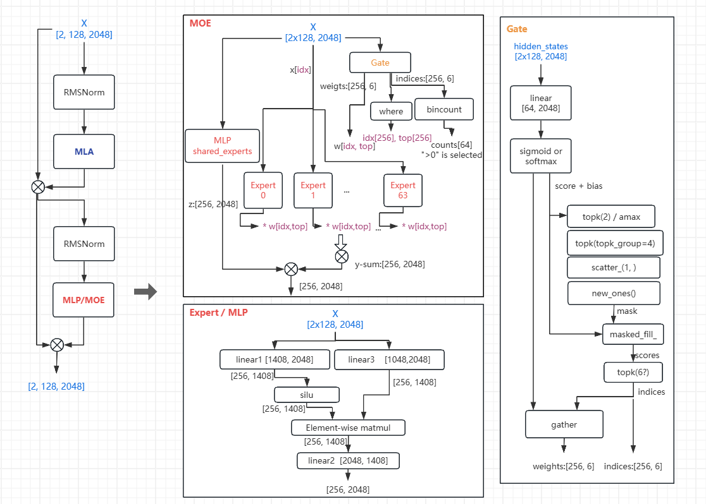
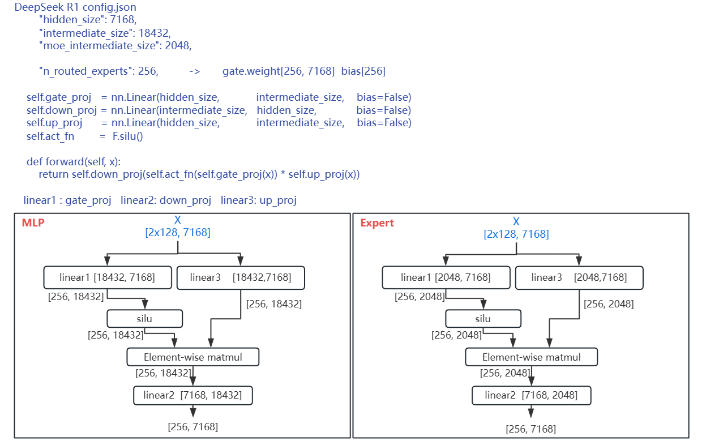
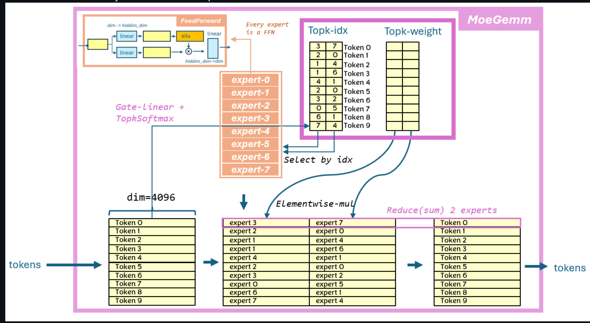
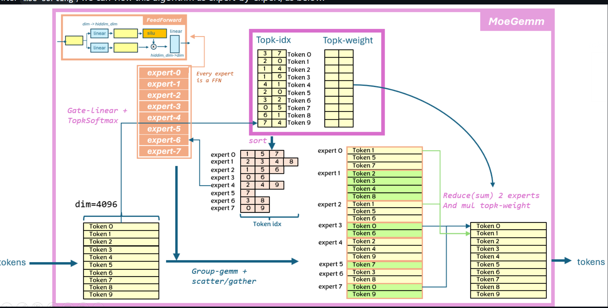
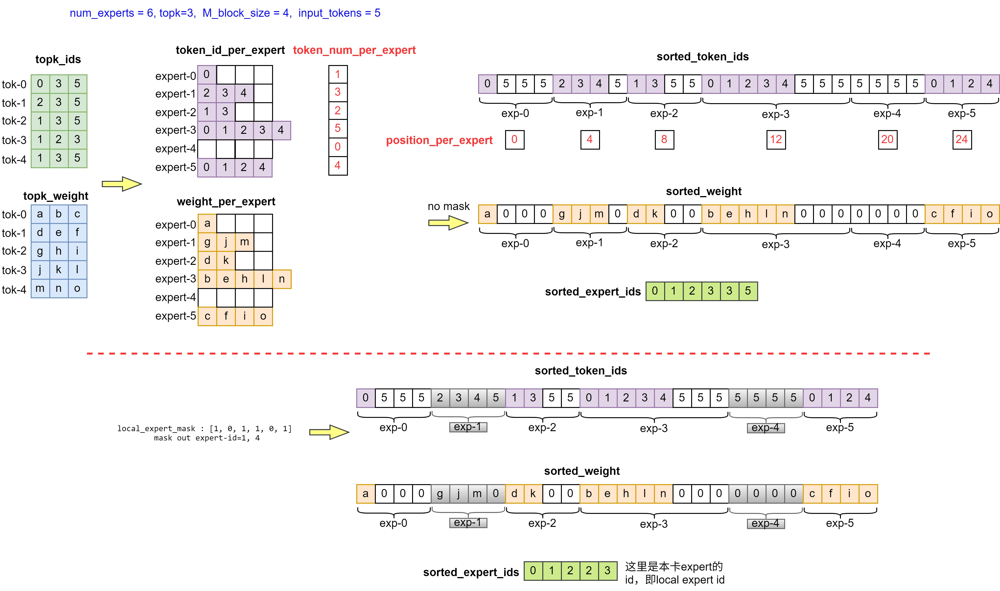
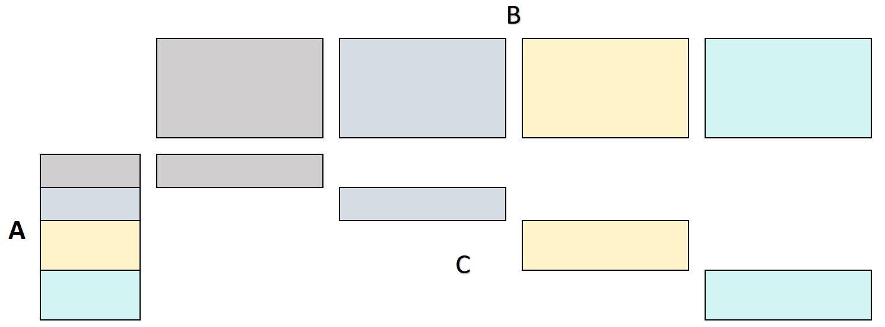

# Fused MOE opt

## gate / MOE 的结构

    

参考 code: https://github.com/deepseek-ai/DeepSeek-V3/blob/main/inference/model.py     


* idx, top = torch.where(indices == i)    
  y[idx] += expert(x[idx]) * weights[idx, top, None]         
  找出选择 expert i 的 所有token idx,  weights[idx, top] 是 这个 token 第 top 个 expert 的标量 weight    

* 一个 expert 的运算  self.w2(F.silu(self.w1(x)) * self.w3(x))， deepseek mlp/expert 如下，    


* 每个 token 可能会经过不同的 expert，不同结果再累加

* token by token 计算过程    
  以 deepseek 为例， 下图是 token by token 的计算过程。如果采用这种方式，每个 token 都需要执行 topk 次 gemm （读 topk 的 expert weight 进行 concat）来算出各 expert 的 output， 再 reduce
  
* expert by expert 计算过程    
  如果转换为 expert by expert 的视角能极大提高计算效率。 下图是 expert by expert 的示意图。通过 sort 之后，每个 expert 只用通过一次 gemm 计算就可以把所有发到这个 expert 的 token 全部计算完。即使有 pad，也是浪费了算力 （mmac 指令都是按固定M进行计算的，比如我们的tensor core 只能 16x16x32，所以必须对齐），对于更关键的 bandwidth 没有明显浪费。同时最后的 moe sum 可以通过 atomic 完成，不需要另外的 temp buffer 和 另起 kernel    
      
  从 gate/up/down projection 的权重可以 concat 起来， 只调用 1 次 gemm 即可完成所有计算。 因此 上面的计算过程可以抽象为 scatter_gemm + silu + mul_reduce + gather_gemm.     
  由于 expert 不一定在一张卡上全部放下，可能分散到多卡甚至多节点上。因此最后还需要进行 moe_sum 把所有要计算的 token 对应的 gather_gemm 结果 reduce (TP or EP)

## MoE_Sorting
  MoE_sorting 主要根据以 token 视角输出的 topk_ids, topk_weight 重新排序整理，输出以 expert 为视角的 sorted_token_ids, sorted_weight 及 sorted_expert_id, 如下图    
      
  参考 code：  https://github.com/ROCm/composable_kernel/blob/develop/include/ck_tile/ops/fused_moe/kernel/moe_sorting_kernel.hpp    
   * 输入 topk_ids，其 shape为 [tokens, topk]，即每个 token 得到 topk 个 expert 的序号;    
   * 输入 topk_weight，其 shape 为 [tokens, topk]，即每个 token 的 expert 所对应的权重;    
   * 按照 expert 来划分，得到每个 expert 对应的 token id = token_id_per_expert,  weight = weight_per_expert;    
   * 需要将上述两个 tensor 变为对齐的连续空间；(取对齐粒度 M_a=4，即每个 block_m，也称为 unit_size)。每个 expert 对应 token 个数不足 M_a 的倍数的部分，使用无效值补齐。    
     * 在单卡无 local_expert_mask 的情况下，最终得到如图右上所示的 sorted_token_ids 的 token id 与sorted_weight 权重排布；同时，按照 M_a 个 token_id 一组，根据 sorted_token_ids 中对应expert 序号，得到 sorted_expert_ids。    
     * 若使能 local_expert_mask，最终将根据此掩码忽略无效 expert，得到如上图下面所示的 sorted_token_ids 与 sorted_weight 权重排布；同时无效的 expert 不占用序号，得到本卡的 expert 排布 sorted_expert_ids。   
     * 目前 example 中 sorted_token_ids 的长度，是按照极端最坏情况计算的，即所有 token 均选择了相同的 topk 个 expert，而且 sorted_token_ids 保留 padding 数据，所以：max_num_tokens_padded = topk * input_tokens + num_experts * M_a - topk    

## scatter_gemm + silu + mul_reduce + gather_gemm 计算模拟
[./siliconflow_moe.py](./siliconflow_moe.py) 可在 torch 环境中运行    

scatter_gemm 有什么好处， 它里面同样是分成 小矩阵块计算？    
主要是内存布局 + GPU kernel 组织方式， 以 expert 视角进行 MoE, weight 不用重复加载    

* 避免很多 kernel launch    
  * Naive MoE GEMM shape 较小，需要更多的 kernel launch, GPU SM 利用率低    
  * scatter_gemm 一个 kernel launch    
  * tokens regroup (permutation) 之后 GPU global memory coalescing 更好    

* scatter_gemm 是 grouped GEMM, 大 tile 且连续 memory，一个 GPU block 处理 一个 expert 的 一块tokens  [M_a, hidden] × [hidden, ffn]， 且多个 block 并行    

参考： 如何开发一个高效的融合 MoE 算子  https://www.bilibili.com/video/BV1yZDhYwE92/?spm_id_from=333.1391.0.0&vd_source=4a024a28293bdbd614cd39b4641830dc    

## Grouped GEMM
[./grouped_gemm.py](./grouped_gemm.py)    
用 TN 的数据布局来举例，A 的形状是 [M, K], B 的形状是 [NUM_GROUPS, N, K]，结果 C 的形状是 [M, N]。伴随 A 的有一个输入是 m_indicies，它是一个长度为 M 的一维数组，用来指定 A 的每一行使用 B 的哪一个 group 的权重来进行矩阵乘。    
一般用于将多个小矩阵的乘拼接成一个大矩阵的乘，来增大对于硬件资源的利用率以及减小多个内核启动的开销    


## Batched GEMM
跟 groupd-gemm 类似，不过每 group 的行数都是一样的，并且 C 不拼接到一起。也就是 [Batch, M, K] @ [Batch, N, K] -> [Batch, M, N]，批处理矩阵乘

## Grouped GEMM Masked
跟 batched-gemm 类似，但是每个 batch 的有效的行数（M）可以不一样，通过一个额外的参数 masked_m 来指定每个 batch 的有效的行数是多少。形状是 [Batch, M_max, K] -> [Batch, N, K] -> [Batch, M_max, N]

## aiter.ops.triton.fused_moe 实现

### 1. code trace   
    [aiter](https://github.com/ROCm/aiter)     
    [composable_kernel](https://github.com/ROCm/composable_kernel)    
```
aiter\ops\triton\fused_moe.py      
                  sorted_token_ids = moe_align_block_size() -> moe_align_block_size_triton()
                  fused_experts_impl - > invoke_fused_moe_kernel
    aiter\ops\triton\moe_op.py   fused_moe() - > fused_moe_kernel
```
 * fused_experts_impl()    
  for 循环，(for chunk in range((num_tokens // CHUNK_SIZE) + 1): ) 完成整段 moe 计算流程，     
  第一个 invoke_fused_moe_kernel() (在激活前) 对 curr_hidden_states 按 expert 进行第一个线性投影（W13），并把结果写入 intermediate_cache1。在实现里，W13 的输出被组织成两半: 第一半是需要做激活的部分，第二半是要与激活后结果点乘的部分。因此第一个 kernel 负责把每个 token/top-k 的这两个半向量计算并放到 intermediate_cache1
 * triton_silu_and_mul / triton_gelu_and_mul：这两个 kernel 从 intermediate_cache1 读取“两个 half”, 比如 x0 为前半，x1 为后半；计算 act = SiLU(x0) 或 GELU(x0)，然后 y = act * x1（逐元素点乘），并把结果写入 intermediate_cache2。也就是把 W1 的双分量转换为单个中间向量，准备用于 W2
 * 第二个 invoke_fused_moe_kernel(...)（在激活后）以 intermediate_cache2 为输入，对各自 expert 做第二个（W2），把 expert 输出写入 intermediate_cache3（组织为 [M, top_k, hidden])

 * triton_moe_sum 如何知道哪些 expert 的输出属于哪个 token，    
   比如 num_experts = 6, topk=3, block_size_M=4, input_tokens=5, topk_ids 分别为     
   token0: 0,3,5,    
   token1: 2,3,5,    
   token2: 1,3,5,    
   token3: 1,2,3,    
   token4: 1,3,5    

   通过 moe_align_block_size (或 moe_sorting_ck) 把所有 token 按 expert 分组并填充到 block_size_M 的倍数， 生成 sorted_token_ids 和 expert_ids     

   按 block_size_M 扫描 sorted_token_ids ， 取出一段连续的 sorted tokens, 和 对应的 expert_ids[pid_m] 选取 expert weights , 做 GEMM， 得到若干行输出

   如何写回：    
   triton_moe_sum / moe_sum：  完成对应 token 的 topk 个结果的累加    
       intermediate_cache3 的shape 是 [M=5 * topk=3 * N] 被填充， 内存按 c-contigous 存储
   不论 kernel 内部如何处理， 最终保证 intermediate_cache3 每个有效的 flattened row (token_id * topk + rank) 被放置对应 expert 的输出向量。后续 triton_moe_sum 只按第 1 维(M) 和 第 2 维 (topk) 累加即可得到每个 token 最终聚合向量。    
    intermediate_cache3[0,0,:] ← 专家 0 对 token0 的输出    
    intermediate_cache3[0,1,:] ← 专家 3 对 token0 的输出    
    intermediate_cache3[0,2,:] ← 专家 5 对 token0 的输出    
    intermediate_cache3[1,0,:] ← 专家 2 对 token1 的输出    
    intermediate_cache3[1,1,:] ← 专家 3 对 token1 的输出    
    intermediate_cache3[1,2,:] ← 专家 5 对 token1 的输出    
    intermediate_cache3[2,0,:] ← 专家 1 对 token2 的输出    
    intermediate_cache3[2,1,:] ← 专家 3 对 token2 的输出    
    intermediate_cache3[2,2,:] ← 专家 5 对 token2 的输出    
    intermediate_cache3[3,0,:] ← 专家 1 对 token3 的输出    
    intermediate_cache3[3,1,:] ← 专家 2 对 token3 的输出    
    intermediate_cache3[3,2,:] ← 专家 3 对 token3 的输出    
    intermediate_cache3[4,0,:] ← 专家 1 对 token4 的输出    
    intermediate_cache3[4,1,:] ← 专家 3 对 token4 的输出    
    intermediate_cache3[4,2,:] ← 专家 5 对 token4 的输出

 * 关于 block_size_M=4 的影响（padding）    
   为了让每个 expert 的工作项对齐到 BLOCK_SIZE_M 的倍数，排序阶段会把每个 expert 分配到的 (token,rank) 对按 expert 汇聚并在需要时用 padding 条目补齐到块大小（比如某个 expert 只有 2 个分配项，会被填充到 4 的倍数）。    
   这些 padding 条目在 sorted_token_ids 中用 sentinel（通常等于 topk_ids.numel()）表示，kernel 在处理时通过 token_mask 屏蔽掉，不写入 intermediate_cache3。    
   所以 intermediate_cache3 的 shape 仍为 (M,topk,N)；但底层 sorted_token_ids/expert_ids 的顺序和 padding 仅影响 kernel 的执行顺序与并行效率，不改变最终有效位置映射（如上所列）。    


### 2. moe sorting 有  triton 实现 moe_align_block_size， 也有 ck 实现 moe_sorting_ck
```
moe_sorting_fwd
    aiter/csrc/py_itfs_ck/moe_sorting_kernels.cu
    composable_kernel\example_hcu\ck_tile\13_moe_sorting\moe_sorting_api.hpp
    composable_kernel\example_hcu\ck_tile\13_moe_sorting\moe_sorting_api.cpp
    composable_kernel\include\ck_tile\ops\fused_moe.hpp
    composable_kernel/include/ck_tile/ops/fused_moe/kernel/moe_sorting_kernel.hpp
```

### 3. 两个 gemm
```
step 1. GEMM0:  invoke_fused_moe_kernel(input_tokens, w13)    
step 2. silu:   triton_silu_and_mul()  完成 gate-silu 的结果，再和 up 的结果 点乘
step 3. GEMM1:  invoke_fused_moe_kernel(点乘的结果, w2, topk_weights)  通过 MUL_ROUTED_WEIGHT 判断是否乘 topk_weights
step 4. triton_moe_sum
```

## aiter.fused_moe_asm_wna16 实现
```
aiter\aiter\fused_moe_asm_wna16.py

step1: aiter.asm_fmoe_a8
step2: triton_silu_and_mul
step3: aiter.asm_fmoe_a8
step4: triton_moe_sum

asm_fmoe_a8
    aiter\csrc\py_itfs_asm\asm_fmoe_a8.cpp  - > FMoeKernelA8
         - >  /usr/local/lib/python3.10/dist-packages/aiter_meta/hsa/gfx938/w16a16/bf16/stage1/ *.co
```

参考：
https://zhuanlan.zhihu.com/p/23129261011 