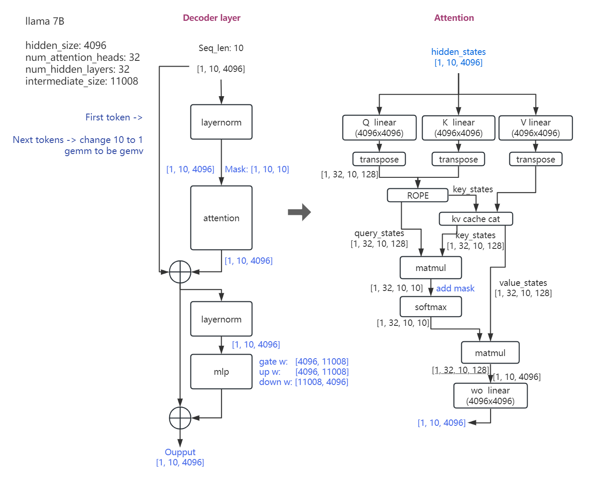
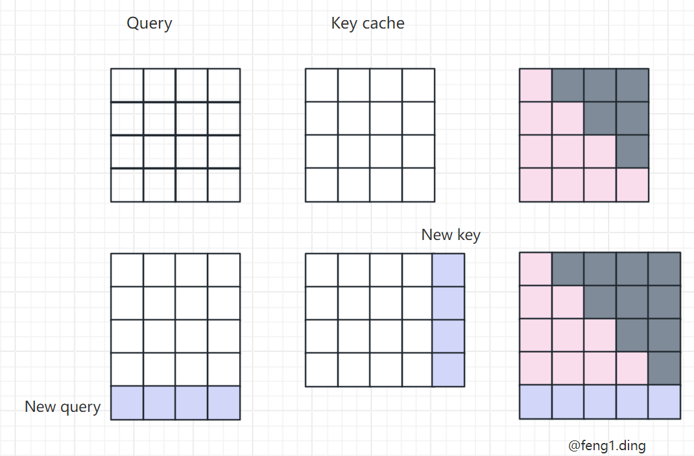

# llama decode

## 1. Run
$ python ./llama_model.py

## 2. Notes

* First token:     
    * KV cache is null.     
    * After input_ids computing, first token is output.    
    * KV shape [token_len, hidden_size]    
    * KV cache size is 2 * token_len * hidden_size * num_layers    

    * attn_mask [10, 10] ,  上三角为负无穷

* Second token:    
    * Input first token hidden_states,  [1, 4096]
    * KV cache + first token hidden_states's KV    [token_len + 1, hidden_size]
    * Second token is output.
    
    * attn_mask [1, 11], 针对长序列mask

* Next token:    
    * Input second token hidden_states, [1, 4096]    
    * KV cache + first/second token hidden_states's KV [token_len + 2, hidden_size]
    * Next token is output.

* ...     

* ROPE https://arxiv.org/pdf/2104.09864.pdf   https://cloud.tencent.com/developer/article/2327751    
    * Every head [32, 128] is split to [2, 64], to be (x1, x2), and cosΘ, sinΘ to rotate to be new (x1, x2), and [32, 128].  Θ is got from i and d.

## 3. KV Cache

1. 重点：新的 token  的 query 只和 之前 tokens 的 key 产生 score       
    Code 表现为 attn_mask 让 gemm 的结果只取 下三角    
	
2. 没有 KV cache 的情况    
    计算 first token， 比如输入 4 个 token， token 的长度也为4(也可以是4096)， 则  矩阵  4x4  X 矩阵 4x4， 得到 4x4 （4096的结果也是4x4）， 只取下三角，即粉色部分    
    Next， 目前 5 个 token，矩阵5x4 x 矩阵4x5， 得到 5x5， 只取下三角， 即粉色+蓝色部分    
	
3. 在有 KV cache 的情况下    
    计算 first token， 同上    
    Next， 粉色部分不用重复计算，只用计算 new query 和 所有 key 的 sore， 即  1x4  x  4x5， 得到 1x5    
	
    结果和 2没有 KV cache 的情况下一致。    
    Key 部分 cache 起来，每产生一个 token 就会增加一个 key    
  
