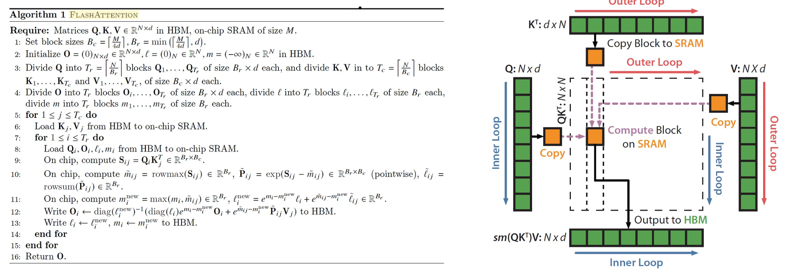
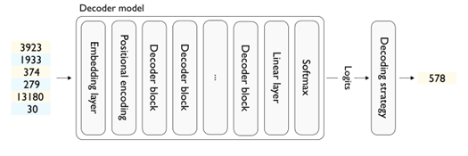
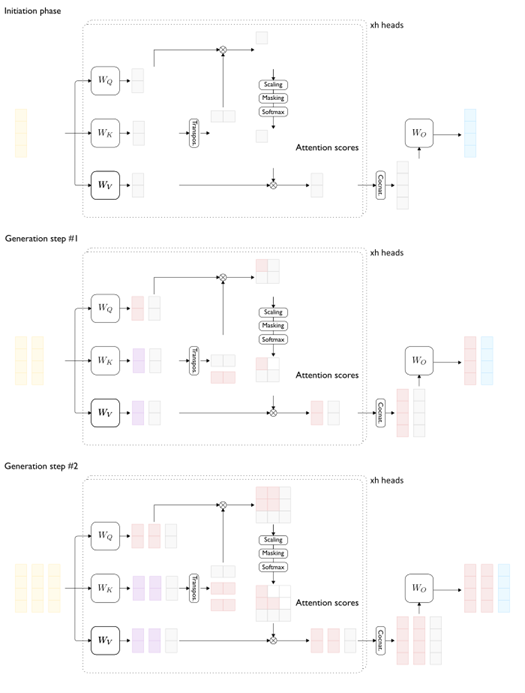
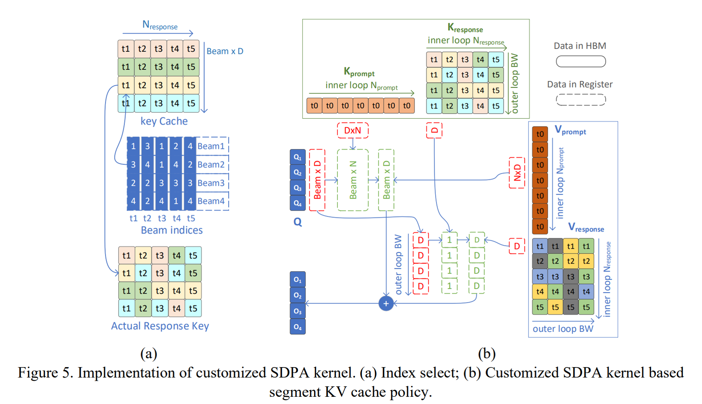

# IPEX Source Code 

[Source](https://github.com/intel/intel-extension-for-pytorch)

## 1. 启动
./intel_extension_for_pytorch/xpu/lazy_init.py
           csrc/gpu/runtime Device.cpp

## 2. GPU Memory 管理
intel-extension-for-pytorch/csrc/gpu/runtime
```
./csrc/runtime/CachingDeviceAllocator.cpp    
                 csrc/aten/core/Allocator.cpp          getDeviceAllocator()
./csrc/gpu/aten/tensor/OpaqueTensorFactories.cpp:15:  auto* allocator = xpu::dpcpp::getDeviceAllocator();
./csrc/gpu/aten/tensor/OpaqueTensorFactories.cpp:52:  auto* allocator = xpu::dpcpp::getDeviceAllocator();
./csrc/gpu/aten/operators/Set.cpp:50:      xpu::dpcpp::getDeviceAllocator(),
./csrc/gpu/aten/operators/TensorFactories.cpp:40:  auto* allocator = xpu::dpcpp::getDeviceAllocator();
./csrc/gpu/aten/quantized/QTensor.cpp:27:  at::Allocator* allocator = xpu::dpcpp::getDeviceAllocator();
```

## 3. model.to("xpu")
```
torch/nn/modules/module.py
  torch.no_grad()
  torch/autograd/grad_mode.py
```

## 4. torch.jit.trace()
```
    torch/jit/_trace.py  trace_module()
```

## 5. fusion_pass
csrc/gpu/jit/fusion_pass.cpp
```
pass_3()  -> xpu::FusionPass(g);  ->  OpFuser(graph->block(), graph).run();  --> processNode()
      
              ->isFusable() -> dnnlRules.find()
RegisterPreFusionPass::RegisterPreFusionPass(GraphPass p) {
  registerPrePass(std::move(p));    这个是 torch pass_manager 里的函数 ！！！！
}
```

## 6. ipex.optimize

## 7. ipex.optimize_transformers
```
transformers/optimize.py 482  optimize_transformers（）
intel_extension_for_pytorch/frontend.py    optimization.fuse

        transformers/optimize.py 482  optimize_transformers（）
intel_extension_for_pytorch/frontend.py    optimization.fuse

      ipex.optimize_transformers
这个是  optimizer_transformers 的Apply optimizations at Python frontend to the given transformers model (nn.Module).    This API focus on transformers models, especially for generation tasks inference.    Well supported model family: Llama, GPT-J, GPT-Neox, OPT, Falcon.

           ipex   frontend.py
                optimizer("O1")    
        # Apply optimizations at Python frontend to the given model (nn.Module), as
    well as the given optimizer (optional). If the optimizer is given,
    optimizations will be applied for training. Otherwise, optimization will be
    applied for inference. Optimizations include ``conv+bn`` folding (for
    inference only), weight prepacking and so on.
    import torch.fx.experimental.optimization as optimization
       optimization.fuse()
                        fuse conv+batchNorm
       linear_bn_fuse  : implementation follows https://github.com/pytorch/pytorch/blob/master/torch/fx/experimental/optimization.py#L50
             fuse linear + batchnorm
    utils._model_convert.replace_dropout_with_identity
    utils._model_convert.convert_module_data_type
    utils._weight_prepack.weight_prepack_with_ipex
    forward  torch.jit.trace
```
converter 定义了一系列转换的函数，包含了module_replacer 和tensorslilcer 
module_replacer的作用就是因为要使用我们ipex对kernel的优化，所以必须把transformer定义的module和function hook过来，完成替换，这个定义了替换的操作
tensor silicer 顾名思义，就是一个tensor parallel的辅助函数
哪里 hook 的？def default_replaced_module_dict():
```
    import transformers
    from diffusers.models.attention import BasicTransformerBlock
    default_replace_modules = {
        transformers.models.gptj.modeling_gptj.GPTJBlock: NewIPEXGPTJBlock,
        transformers.models.llama.modeling_llama.LlamaDecoderLayer: NewIPEXLLAMABlock,
        transformers.models.opt.modeling_opt.OPTDecoderLayer: NewIPEXOPTBlock,
        transformers.models.bloom.modeling_bloom.BloomBlock: NewIPEXBloomBlock,
        # only support transformers version model, not in-library model
        transformers.models.falcon.modeling_falcon.FalconDecoderLayer: NewIPEXFalconBlock,
        BasicTransformerBlock: NewIPEXBasicTransformerBlock,
    }
    return default_replace_modules
```

## 8. custom op 实现
```
IPEX_OP_REGISTER_DISPATCH(
      "beam_search_topk", beam_search_topk, c10::DispatchKey::XPU);
 
./csrc/utils/CustomOperatorRegistration.h
```

## 9. Attention SDPA
### Basic multi head attention
https://github.com/johnpzh/cudnn_samples_v8/blob/master/multiHeadAttention/attn_ref.py

### Flash attention
 <BR>

1. https://fancyerii.github.io/2023/10/23/flashattention/    论文解读
2. M 是 SRAM 的size。 𝑁 is the sequence length and 𝑑 is the head dimension。for GPT2, 𝑁 = 1024 and 𝑑 = 64    
3. 第12 行是关键，  局部的  Pij  （相当于求softmax的分子部分）就可以和 V 提前相乘了多少个 j ， 就要和 V 乘多少次， 而原始的完整的 softmax结果和 V的一列只乘一次乘的次数变多，但每次 Pij 的长度变短了    
4. 内循环是 Qi, 一个一个的， 去和  K的某一个Kj block， V的某一个 Vj block，去乘    
5. 外循环是 K 和 V 移到下一个 block    
6. flash attention 明显对  batch/training 即多query 是有收益的，通过减少 hbm 的读写访问，那么对 inference next token, 有帮助吗， 即每次就一个 query，？    
7. 一般情况下， 一个 token， 和先前所有token （包括它自己）算attention， 把这个token 的所有 sotfmax 都算出来再乘V， SRAM 应该是放的下的吧。 除非历史token 太多 （K V 太多）， SRAM 装不下，那么用 flash attention 才有收益对么？   
8. Flash attention-2 主要就是 把 query 横着切了一下 ？ 之前 flash attention-1 是 所有 token Qi 一起计算的  是么？    

### Flash decoding	
https://pytorch.org/blog/flash-decoding/    
flash-decoding 又把  K， V 切了几刀， 相当于外循环并行起来了~~

https://crfm.stanford.edu/2023/10/12/flashdecoding.html    
https://github.com/facebookresearch/xformers/tree/main/examples/llama_inference    

### Code
```
csrc/gpu/aten/operators/transformers/attention.cpp
   xetla_fsdp_forward_atten_mask_alibi_strided()
   gpu::xetla::fmha_forward_kernel()

IPEX_LIBRARY_FRAGMENT() {
  IPEX_OP_REGISTER_DISPATCH(
      "xetla_fsdp_index_forward.xpu",
      at::AtenIpexTypeXPU::xetla_fsdp_index_forward,
      c10::DispatchKey::XPU);
}

csrc/gpu/aten/operators/comm/RegistrationDeclarations.h  _scaled_dot_product_efficient_attention
all_functions.yaml
xpu_functions.yaml

csrc/gpu/aten/operators/xetla/kernels/SDP/fmha_forward_causal_strided.cpp
   fmha_forward_kernel() 
         fmha_forward_causal_strided() -> fmha_forward_causal_strided_impl()
 
fmha_forward_causal_strided_impl() {
 
cgh.parallel_for(NdRange, [=](sycl::nd_item<3> item) SYCL_ESIMD_KERNEL {
 fmha_fwd_op(ei, args);
}
fmha_forward_op_t = fmha_forward_causal_strided_t
fmha_forward_op_t fmha_fwd_op;
class fmha_forward_causal_strided_t {
   line 674:  inline KERNEL_FUNC void operator()
 
}
}

ipex.optimize_transformers()
    intel_extension_for_pytorch/transformers/optimize.py 
              optimize_transformers()
             model_convert_lowering()

    intel_extension_for_pytorch/transformers/models/xpu/optimize_transformers/modules/_transformers.py

intel_extension_for_pytorch/transformers/models/xpu/optimize_transformers/modules/_transformers.py
              def self_attention()
                  torch.xpu.IpexSDP
                  torch.xpu.IpexSDP_Index

csrc/gpu/aten/operators/xetla/kernels/SDP/fmha_forward.cpp
csrc/gpu/aten/operators/xetla/mha.h

libraries.gpu.xetla/include/common/utils/common.hpp  
         enum class mma_engine : uint8_t { xmx = 0, fpu = 1 };  
```

## 10. Segment KV cache
对 KV cache 的理解    
https://zhuanlan.zhihu.com/p/410776234  attention 输出的向量就是输入向量经过注意力机制加权求和之后的表示。
https://medium.com/@plienhar/llm-inference-series-2-the-two-phase-process-behind-llms-responses-1ff1ff021cd5   
Transformer 解码器计算过程如下图， 解码器输出 logits，然后进入 decoding 阶段，比如 greedy， sample，beam search 等。

 <BR>

https://medium.com/@plienhar/llm-inference-series-3-kv-caching-unveiled-048152e461c8       
如下图，     
1, 输入 “What color is the sky? The sky ” , 其中， “sky“ 是最后一个 token， output representations associated with this token were therefore produced using the representations from all the tokens in the sequence, i.e. the value vectors for “What”, “ color”, “ is”, “ the”, “ sky”, “?”, “The ” and “sky ”， 生成 “is”    
2. 下一步输入是 “What color is the sky? The sky is “， 下图 淡红色，淡紫色代表冗余计算的 keys， values    
“is” 加入到输入 sequence， 我们需要哪些：    
* A query vector for “is “.    
* Key vectors for “What”, “ color”, “ is”, “ the”, “ sky”, “?”, “The ” “sky ” and “is ” to compute attention scores.
* Value vectors for “What”, “ color”, “ is”, “ the”, “ sky”, “?”, “The ” “sky ” and “is ” to compute the output.

其中 “What color is the sky? The sky” 的 keys， values 在之前已经计算过， 只需要计算 “is” 的 key 和 value， 我们只需要哪些：
* Computing a query, a key and a value for “is ”.
*	Fetching key and value vectors for “What”, “ color”, “ is”, “ the”, “ sky”, “?”, “The ” and “sky ” from the cache and concatenating them with the key and value we just computed for “is ”
* Computing the attention scores using the “is ” query and all the keys.
* Computing the output vector for “is ” using the attention scores and all the values.

<BR>

## 11. Beam search
<BR>

## 12. torch.compile
[../torch.compile](../torch.compile/) 

 
