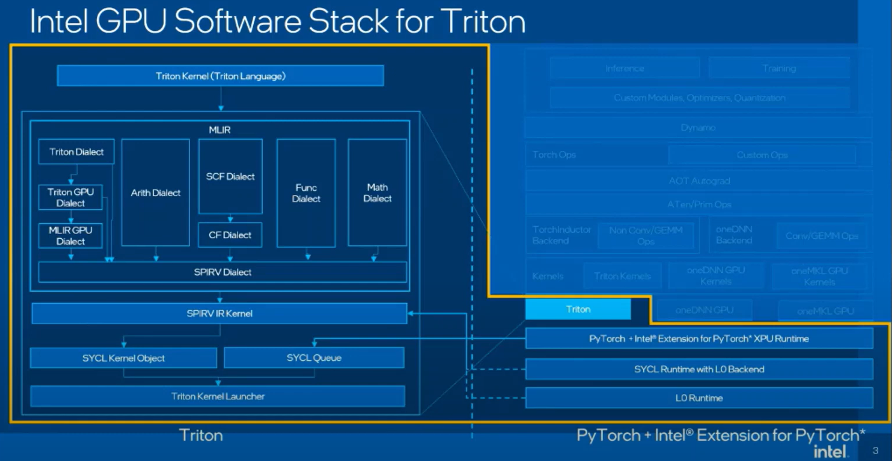
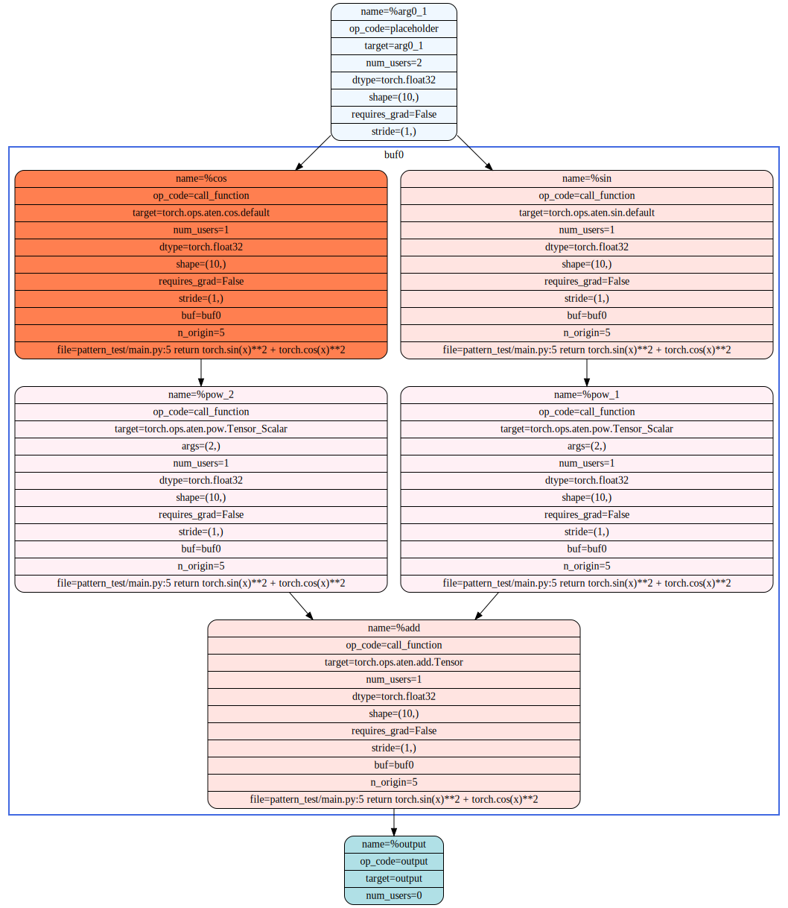
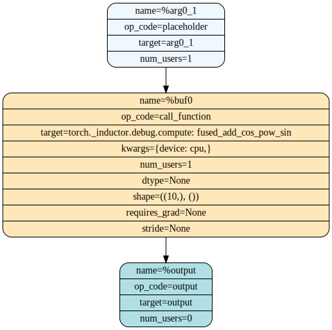

# torch.compile

## 1. Setup and Run
### List compile backends
Env: docker image `intel/intel-extension-for-pytorch:2.3.110-xpu`
```
$ docker run -it --device=/dev/dri --ipc=host --net=host -e http_proxy=$http_proxy -e https_proxy=https_proxy   /bin/bash
$ python
>>> from torch import _dynamo
>>> print(_dynamo.list_backends())
['cudagraphs', 'inductor', 'onnxrt', 'openxla', 'openxla_eval', 'tvm']
```
`inductor` is the default compile backend. Refer to [code](https://github.com/pytorch/pytorch/blob/main/torch/__init__.py#L2297).
### Requirements
```
$ apt-get update
$ apt-get install python3-dev
$ pip install tabulate
```
### How to run cpu inductor compile backend
```
$ python3.10 ./cpu_inductor.py
``` 
### How to run xpu inductor compile backend
```
$ pip install --pre pytorch-triton-xpu --index-url https://download.pytorch.org/whl/nightly/xpu
$ source intel/oneapi/setvars.sh
$ python3.10 ./xpu_inductor.py
```
### How to run my compile backend
```
$ python3.10 ./my_compile.py
```

## 2. Torch Dynamo
Dynamo 发电机的意思，起这名可能是沿用 x86 平台的 DynamoRIO  


[Background](https://www.semianalysis.com/p/nvidiaopenaitritonpytorch)    
[Pytorch 2.0](https://www.semianalysis.com/i/97006309/pytorch)    
[PrimTorch](https://www.semianalysis.com/i/97006309/primtorch)    
[TorchDynamo](https://www.semianalysis.com/i/97006309/torchdynamo)    
[TorchInductor](https://www.semianalysis.com/i/97006309/torchinductor)    
[Triton](https://www.semianalysis.com/i/97006309/openai-triton)

Others,    
https://www.intel.com/content/www/us/en/developer/articles/community/meet-the-maintainers-series-pytorch.html    
https://pytorch.org/docs/main/torch.compiler_dynamo_overview.html       
https://dev-discuss.pytorch.org/t/torchdynamo-an-experiment-in-dynamic-python-bytecode-transformation/361    
https://www.youtube.com/watch?v=kgkqE3E6_28  
https://fkong.tech/posts/2023-05-20-dynamo/   
https://www.youtube.com/watch?v=egZB5Uxki0I    

## 3. Intel Triton

  

- Architecture    
 
  

https://github.com/intel/intel-xpu-backend-for-triton    
https://github.com/intel/intel-xpu-backend-for-triton/blob/main/docs/ARCHITECTURE.md    
https://github.com/triton-lang/triton/tree/main    
https://www.youtube.com/watch?v=KtC1MBb2cy8&list=PLc_vA1r0qoiRZfUC3o4_yjj0FtWvodKAz&index=6   


## 4. Code Init
`make_fallback` means to return to torch origin kernel.
```
torch/__init__.py    compile()   ->  torch._dynamo.optimize
   torch/_dynamo/eval_frame.py  -> optimize("inductor")    --->  The main entrypoint of TorchDynamo.  Do graph capture and call backend() to optimize extracted graphs.
    
torch/_inductor/pattern_matcher.py 


intel_extension_for_pytorch/__init__.py   --> from . import _dynamo
    intel_extension_for_pytorch/_dynamo/__init__.py
       torch/_inductor/compile_fx.py
         torch/_inductor/fx_passes/joint_graph.py   -->          from ..pattern_matcher import
             torch/_inductor/pattern_matcher.py()  --> from .lowering import fallback_node_due_to_unsupported_type
       torch/_inductor/lowering.py ->  make_fallback(aten._scaled_dot_product_flash_attention)
       torch/_inductor/lowering.py 4771-> import_submodule(kernel) 
          torch/_inductor/kernel/bmm.py
                            torch/_inductor/select_algorithm.py(25)   ->   from .codegen.triton import texpr, TritonKernel, TritonPrinter, TritonScheduling
                                 torch/_inductor/codegen/triton.py   ->   class TritonKernel(Kernel)
        
import intel_extension_for_pytorch
     intel_extension_for_pytorch/__init__.py(124)<module>()   -> from . import _inductor
        intel_extension_for_pytorch/_inductor/__init__.py(4)<module>()     -> from . import xpu
           intel_extension_for_pytorch/_inductor/xpu/__init__.py(4)<module>()   -> from .codegen.triton import XPUTritonScheduling
                  intel_extension_for_pytorch/_inductor/xpu/codegen/triton.py(57)<module>()  -> class XPUTritonKernel(TritonKernel):

/torch/_inductor/lowering.py  -> register_onednn_fusion_ops()

torch/_inductor/codegen/triton.py
```

## 5. Pattern matching
[How is pattern matching in inductor fx implemented](https://dev-discuss.pytorch.org/t/how-is-pattern-matching-in-inductor-fx-implemented/1720)    
The pattern matcher here serves as a tool to revise the torch.fx graph module, transforming it according to specific patterns outlined [here](https://github.com/pytorch/pytorch/tree/main/torch/_inductor/fx_passes). For instance, take the well-known flash attention optimization, or [fuse attention](https://github.com/pytorch/pytorch/blob/main/torch/_inductor/fx_passes/fuse_attention.py). If the original fx graph module is detected, the torch inductor will replace it with a new operator named 'aten.scaled_dot_product_attention'.

There are numerous patterns yet to be explored, particularly for GEMM-like operators. If multiple operators fall within the scope of pointwise or reduction types, the [inductor scheduler](https://github.com/pytorch/pytorch/blob/main/torch/_inductor/scheduler.py) will seamlessly fuse them into a single operator. Following this, it will invoke the [codegen backend](https://github.com/pytorch/pytorch/tree/main/torch/_inductor/codegen), such as OpenMP for CPU or Triton for GPU, to execute the operation. Exploring how to identify and create efficient patterns, as well as designing a general scheduler and IR suitable for a wide range of ML workloads, remains an intriguing and complex challenge.

## 6. Debugging

### Run test_cpu.py

```
$ TORCH_COMPILE_DEBUG=1 INDUCTOR_ORIG_FX_SVG=1 python3.10 test_cpu.py
```
It will generate logs and the below files:

| File | Description |
|  --------  |  -------  |
| orig_fx_graph_diagram.svg| original fx graph diagram |
| graph_diagram.svg| fx graph diagram after fusion |
| fx_graph_readable.py| |
| fx_graph_runnable.py|Executable FX graph, after decomposition, before pattern match|
|fx_graph_transformed.py|Transformed FX graph, after pattern match|
|ir_pre_fusion.txt|Inductor IR before fusion|
|ir_post_fusion.txt|Inductor IR after fusion|
|output_code.py|Generated Python code for graph, with C++/Triton kernels|    

Note that fx_graph_runnable.py and output_code.py are both runnable and editable in order to make debugging easier.    

sin^2+cos^2 function’s nodes are merged like,    

| orig_fx_graph_diagram.svg | graph_diagram.svg |
|  --------  |  -------  |
  |      

More reference [here](https://pytorch.org/tutorials/intermediate/inductor_debug_cpu.html)

### Run test_xpu.py
```
$ pip install --pre pytorch-triton-xpu --index-url https://download.pytorch.org/whl/nightly/xpu
$ source intel/oneapi/setvars.sh
$ TORCH_COMPILE_DEBUG=1 INDUCTOR_ORIG_FX_SVG=1 python3.10 test_xpu.py
```
Note the C++/Triton kernels generated in output_code.py is different from the generated by test_cpu.py.

## Run Triton kernel
```
$ TRITON_DEBUG=1 TRITON_INTERPRET=1  python3.10 vector-add.py
```
* [SPMD (Single Program, Multiple Data), is based on blocked, rather than threads (cuda)](https://github.com/intel/intel-xpu-backend-for-triton/blob/main/docs/programming-guide/chapter-1/introduction.rst), to facilitate the construction of high-performance compute kernels for neural networks,  and offer programmers more flexibility than existing DSLs when implementing sparse operations, all while allowing compilers to aggressively optimize programs for data locality and parallelism.  
* [compiler.py](https://github.com/intel/intel-xpu-backend-for-triton/blob/main/third_party/intel/backend/compiler.py) pybind11 -> /usr/local/lib/python3.10/dist-packages/triton/_C/libtriton.so -> [code](https://github.com/intel/intel-xpu-backend-for-triton/tree/main/python/src)  

* Code trace
   ```
   @triton.jit
   def add_kernel() -> 
      triton/runtime/jit.py  -> jit() -> JITFunction()  -> self.run() 
         self.compile() 
            triton/compiler/compiler.py  -> compile() -> 

               src.make_ir() -> code_generator.py ast_to_ttir()

               for ext, compile_ir in list(stages.items())[first_stage:]:
                  make_ttir    --> third_party/intel/backend/compiler.py  --> XPUBackend::make_ttir()
                  make_ttgir   --> third_party/intel/backend/compiler.py  --> XPUBackend::make_ttgir()
                  make_llir    --> third_party/intel/backend/compiler.py  --> XPUBackend::make_llir()
                  make_spv     --> third_party/intel/backend/compiler.py  --> XPUBackend::make_spv()
               CompiledKernel()
               
         kernel.run()   
      
   ```
* List intermediate ir files, 
   ```
   $ls /root/.triton/cache/10542ed3504f38ca46ccdb4d2a5594f28c5e79137f7dcf1daaf3088b66cefc15/
   __grp__add_kernel.json  add_kernel.json  add_kernel.llir  add_kernel.spv  add_kernel.ttgir  add_kernel.ttir
   ```

More reference:    
https://github.com/intel/intel-xpu-backend-for-triton  
https://triton-lang.org/main/getting-started/tutorials        
