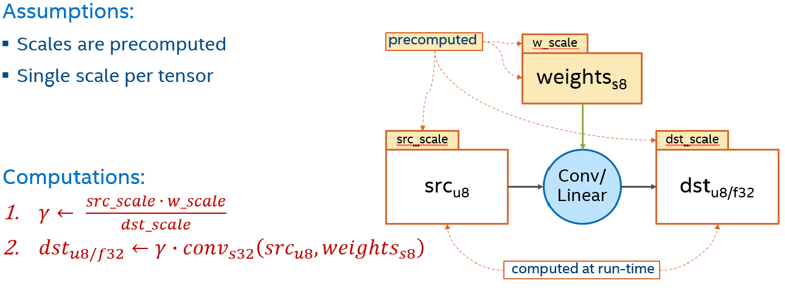
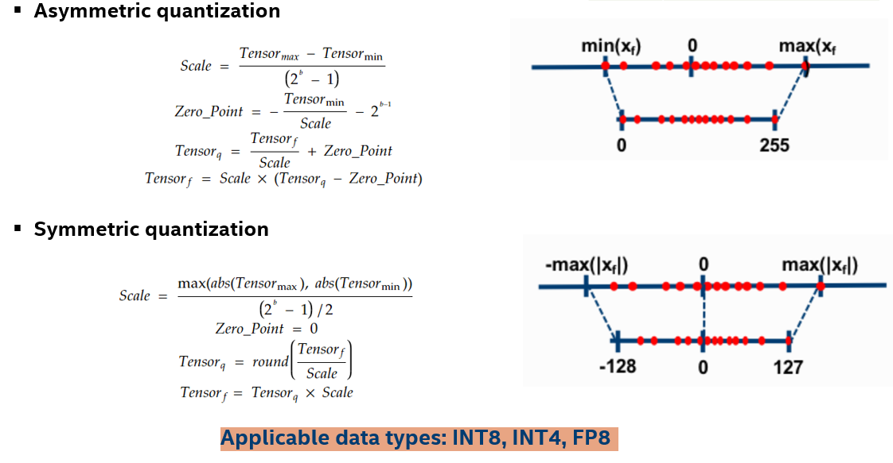
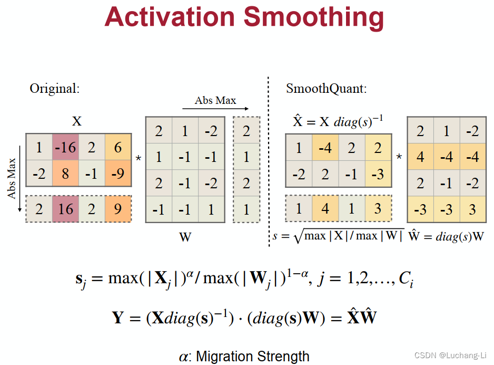
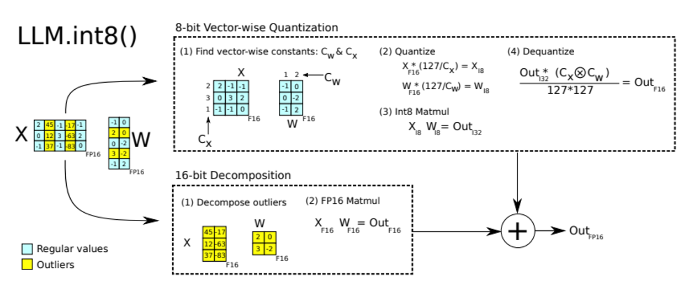
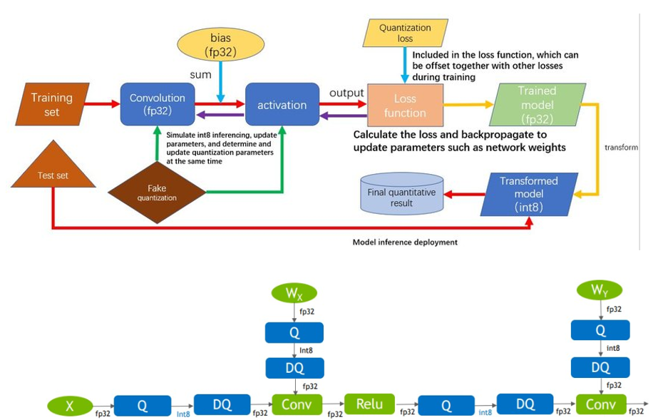
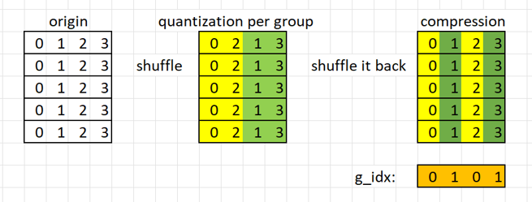
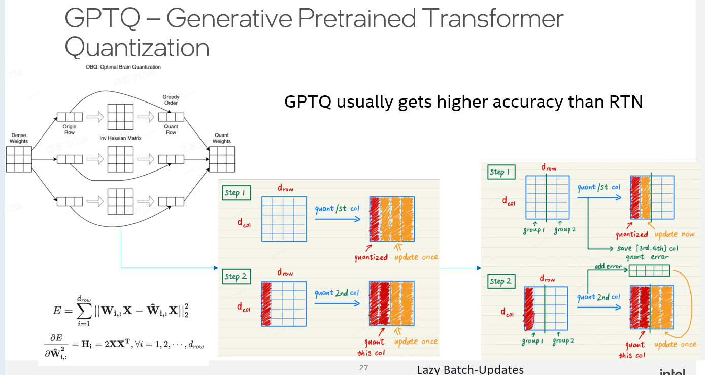
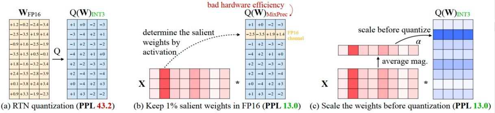
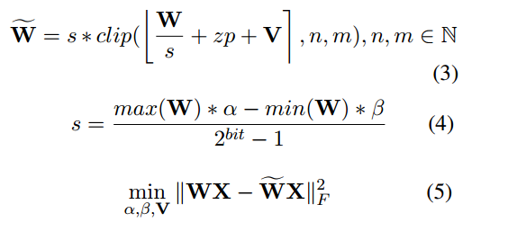

# Quantization

## Static quantization
需要额外的校验数据集， 前向推理搜集 tensor 分布，获取 min, max, zero point scale , op 是 int8    

Y_fp32 = X_fp32 @ W_fp32 + B_fp32    
X_int8 = (X_fp32 / src_scale).round()    
W_int8 = (W_fp32 / weight_scale).round()    

Y_int32 = X_int8 @ W_int8 + bias_int32  # 累加操作在 int32 中完成    
    其中 int8 x int8 -> int16 -> 累加到 int32,  -> 输出为 int32 类型    

Y_fp32 = Y_int32 * (src_scale * weight_scale)    
如果输出量化后的 int8, 则    
Y_int8 = Y_fp32 / dst_scale    
            = Y_int32 * (src_scale * weight_scale / dst_scale)    
     其中 requant_scale = (src_scale * weight_scale) / dst_scale    




One scale for weight and Per output channel scale for weight.

## Dynamic quantization
不需要额外校验，  根据当前 tensor 分布 获取 min max，  zero piont  scale

## WOQ
8 个4 bit 组成 32 bits -> unpack -> fp32, fp16,  input 保持不变

## 对称 非对称
weights 一般是 对称的，所以用 对称量化    
input, activation 是非对称的，所以一般用非对称量化    

symmetric quantization    
asymmetric quantization    



## SmoothQuant
LLM has significant outliers in activation    
Shifting activation outliers to weight    
Intuiton: 1x100 = 10x10    


## LLM.int8()
输入里的 outlier 分离出来 用高精度计算， 正常的用 int8, 再加起来    
对硬件指令不友好    


## Quantization aware training
    
LLM 成本太高 不采用

## Mixed-Precision
fp32,   s, 8 bit exp, 23 bit mantissa    
fp16,   s, 5 bit exp, 10 bit mantissa    
bfp16,  s, 8 bit exp, 7 bit mantissa    
BF16, Proposed by google. same range with fp32, precision is lower than fp32    
范围更重要    
AVX512_BF16 指令只有乘加操作，对于非乘加操作都 fallback 到 fp32 avx512 指令

## WOQ
7B 16G -> int4 packed weight -> 4~5G    

### GPTQ
    
分析权重中哪些对最终精度损失影响最大的    
Hessian 汉森矩阵: 用于确定模型参数对输出的敏感程度（即二阶导方向上的影响）    
行与行之间的影响  而不是每个元素都算    
    
分 group， quant error 之后加到一块    
https://github.com/IST-DASLab/gptq    
有  torch  cpp_extension 的使用    
from torch.utils import cpp_extension    

### AWQ
根据输入找 1% weight 中的 outlier    
Perplexity     


```
AWQ:
model.layers.0.self_attn.q_proj.qweight torch.Size([4096, 512]) torch.int32 <class 'torch.Tensor'>
model.layers.0.self_attn.q_proj.qzeros torch.Size([32, 512]) torch.int32 <class 'torch.Tensor'>
model.layers.0.self_attn.q_proj.scales torch.Size([32, 4096]) torch.float16 <class 'torch.Tensor'>
FP16
model.layers.0.self_attn.q_proj.weight torch.Size([4096, 4096]) torch.bfloat16 <class 'torch.Tensor'>
model.layers.0.self_attn.k_proj.weight torch.Size([1024, 4096]) torch.bfloat16 <class 'torch.Tensor'>
model.layers.0.self_attn.v_proj.weight torch.Size([1024, 4096]) torch.bfloat16 <class 'torch.Tensor'>
model.layers.0.self_attn.o_proj.weight torch.Size([4096, 4096]) torch.bfloat16 <class 'torch.Tensor'>


4096 = 32 * 128 
    Group size = 128    128 个 qweight 共享一个 qzero， 共享一个 scale
4096 = 512 * 8    1 个int32 包含 8 个 int4

float q_zero = (float)(packed_q_z >> (4 * (threadIdx.x / 4)) & 0xF);
float scale = (float)loadFromMem(&scales[index * scales_height + group_y]);

uint32_t packed_q_w = loaded_packed_wts[q_index];
float q_weight = (float)(packed_q_w & 0xF);
float w = (q_weight - q_zero) * scale;
```
1% 的 salient weight  ？一小部分权重保持原来的精度(FP16)    
激活值就是与权重矩阵作matmul运算的输入值，按激活值绝对值大小由大到小排序，绝对值越大越显著，选择前0.1%~1%的元素作为 salient weight    
将模型权重(Weight)量化为4bit，并在计算激活值(Activation)时反量化为FP16，即W4A16    
避免方法在实现上过于复杂，在挑选显著权重时，并非在“元素”级别进行挑选，而是在“通道(channel)”级别进行挑选，即权重矩阵的一行作为一个单位    
如果权重矩阵中有的元素用FP16格式存储，有的用INT4格式存储，不仅存储时很麻烦，计算时取数也很麻烦，kernel函数写起来会很抽象。于是，作者想了一个变通的方法——Scaling。    
量化时对 salient weights 进行放大，可以降低量化误差    
因此，作者改变了思路：为了更加hardware-friendly，我们对所有权重均进行低比特量化，但是，在量化时，对于显著权重乘以较大的 s ，相当于降低其量化误差；同时，对于非显著权重，乘以较小的 s ，相当于给予更少的关注。这便是缩放(Scaling)方法    

[sycl 实现](../sycl/llama_awq)

### Intel autoround
https://arxiv.org/abs/2309.05516    
    
在部分数据集做 forward， backward， 在 backward 中微调 α, β, 调整范围，  V 是 mask 正负决定 rounding 向上还是向下    

微调训练让（5）最小， 用 Frobenius norm.    
Ablation studies 消融实验看上去  V 的贡献不太大



