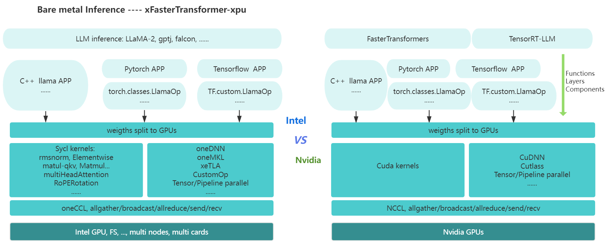

# xFasterTransformer-xpu

This repo is optimized solution for large language models (LLM) on the Intel **GPU** platforms, which is similar to FasterTransformer.     



Experiment platform: dGPU Max 1550, ARC770    
oneAPI: 2023.2.0, 2024.0

## How To Run llama2 cpp
```
$ mkdir build && cd build
$ cmake ..  -DCMAKE_CXX_COMPILER=icpx -DCMAKE_C_COMPILER=icx -DCMAKE_BUILD_TYPE=Debug
$ make -j
```

The model file needs to be downloaded from [huggingface website](https://huggingface.co/meta-llama/Llama-2-7b/tree/main) and converted using a Python script available [here](https://github.com/karpathy/llama2.c). Same page has hte tokenizer.bin file. To avoid the conversion step, ask me(feng1.ding@intel.com) to provide you.
```
$ ONEAPI_DEVICE_SELECTOR=level_zero:0.0 ./bin/llama2_example Your_llama_model_PATH -z ../examples/cpp/llama2_tokenizer/tokenizer.bin -t 0.0 -n 32 -i "Hello there! " -m generate
```

## How to Run llama2 int4 cpp
```
$ mkdir build && cd build
$ cmake ..  -DCMAKE_CXX_COMPILER=icpx -DCMAKE_C_COMPILER=icx -DCMAKE_BUILD_TYPE=Debug
$ make -j
./bin/llama2_example_q4 Your_llama2-7b-awq-q4.bin -z ../examples/cpp/llama2/llama2_tokenizer/tokenizer.bin  -n 256 -i "write an essay about dogs"
```

## How to run llama2 Pytorch (Need torch and IPEX for xpu runtime)
```
$ pip install torch==2.0.1a0+cxx11.abi intel_extension_for_pytorch==2.0.110+xpu  -f  https://developer.intel.com/ipex-whl-stable-xpu

$ mkdir build && cd build
$ cmake ..  -DCMAKE_CXX_COMPILER=icpx -DCMAKE_C_COMPILER=icx -DBUILD_PYT=ON -DCMAKE_BUILD_TYPE=Debug
$ make -j
$ cd ../examples/pytorch/llama/
# Change llama_config.ini -> model_dir to be your llama2 weights bin. 
```

The model file needs to be downloaded from [huggingface website](https://huggingface.co/meta-llama/Llama-2-7b/tree/main) and converted using a Python script available [here](https://github.com/karpathy/llama2.c). Same page has tokenizer.model file. To avoid the conversion step, ask me(feng1.ding@intel.com) to provide you.

```
$ python llama_example.py --tokenizer_path ./llama2_7b_tokenizer/ --lib_path ../../../build/lib/libth_transformer.so --max_batch_size 1 --start_id_file start_ids.csv --output_len 64
```

## Performance
| Model | dGPU |Input size| output size| beam | dtype | First token latency | Average token latency| Max GPU memory|
| --- | --- | --- | --- | --- | --- | --- | --- | --- |
| llama-7B | 1 Max 1550 | 1024 | 128 | 1 | float16 | **140 ms** | **17 ms**| 14.8G |
| llama-7B | 1 ARC 770  | 1024 | 128 | 1 | float16 |            | **40 ms**| 15.2G |
| llama-7B | 1 Max 1550 | 1024 | 128 | 1 | Int4    |            | **8 ms** | 6.1G |
| llama-7B | 1 ARC 770  | 1024 | 128 | 1 | Int4    |            | **17 ms**| 6.1G |

## Next steps
