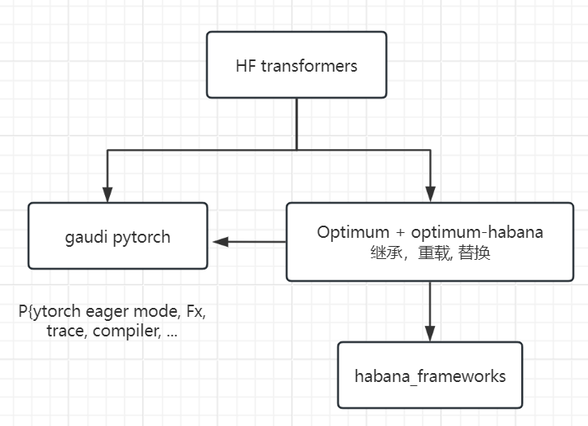

# Neural compressor for Gaudi

## 1. Env
==Make sure Gaudi driver version>=1.18==

### Refer to [neural-compressor](https://github.com/intel/neural-compressor)
```
# Start docker
sudo docker run -it --name=fengding --runtime=habana  -v /home/jenkins/fengding:/home/fengding -e HABANA_VISIBLE_DEVICES=7 -e OMPI_MCA_btl_vader_single_copy_mechanism=none --cap-add=sys_nice --net=host --ipc=host vault.habana.ai/gaudi-docker/1.18.0/ubuntu22.04/habanalabs/pytorch-installer-2.4.0:latest /bin/bash

export https_proxy=http://proxy.ims.intel.com:911
export http_proxy=http://proxy.ims.intel.com:911

pip install neural-compressor[pt]
  or install from source:
    git clone https://github.com/intel/neural-compressor.git
    cd neural-compressor
    pip install -r requirements.txt
    pip install -r requirements_pt.txt
    python setup.py pt develop --user

pip install transformers
```
### Run fp8 quantization test_resnet18.py
```
python test_resnet18.py
## Generate scale factors in "hqt_output/measure_hooks_maxabs.json"
```
### Code trace
```
Prepare, Insert observers into the model so that it can monitor the input and output tensors during calibration.
  neural_compressor/torch/quantization/algorithm_entry.py -> fp8_entry()    :  Habana FP8 Algo Entry
  neural_compressor/torch/algorithms/fp8_quant/_core/measure.py
      def register_patched_measure_modules(model, mod_list, observer_class, d_shapes=None):
```
```
Convert, Convert the prepared model to a quantized model.
  neural_compressor/torch/algorithms/fp8_quant/fp8_quant.py
```
```
Log, export LOGLEVEL=DEBUG
  neural_compressor/common/utils/logger.py   
  os.environ.get("LOGLEVEL", "INFO").upper() 
```

## 2. Run fp8 quantization for LLM on optimum-habana

Refer to [optimum-habana](https://github.com/huggingface/optimum-habana) and [running-with-fp8](https://github.com/huggingface/optimum-habana/tree/main/examples/text-generation#running-with-fp8)

    

```
git clone https://github.com/huggingface/optimum-habana
cd optimum-habana && git checkout v1.14.0
pip install -e .
pip install git+https://github.com/HabanaAI/DeepSpeed.git@1.18.0
cd examples/text-generation
pip install -r requirements_lm_eval.txt
```

### Measure
```
cd examples/text-generation
QUANT_CONFIG=./quantization_config/maxabs_measure.json python3.10 ../gaudi_spawn.py --use_deepspeed --world_size 1 run_lm_eval.py -o acc_7b_bs1_measure.txt --model_name_or_path /home/fengding/Llama-2-7b-hf/ --attn_softmax_bf16 --use_hpu_graphs --trim_logits --use_kv_cache --bucket_size=128 --bucket_internal --use_flash_attention --flash_attention_recompute --bf16 --batch_size 1
## Generate scale factors in "hqt_output/measure_hooks_maxabs_0_1.json"
```

### Convert and eval
```
cd examples/text-generation
QUANT_CONFIG=./quantization_config/maxabs_quant.json python3.10 ../gaudi_spawn.py --use_deepspeed --world_size 1 run_lm_eval.py -o acc_7b_bs1_quant.txt --model_name_or_path /home/fengding/Llama-2-7b-hf/ --attn_softmax_bf16 --use_hpu_graphs --trim_logits --use_kv_cache --bucket_size=128 --bucket_internal --use_flash_attention --flash_attention_recompute --bf16 --batch_size 1
```
> 1. spawn means 产卵    
> 2. 'run_lm_eval.py' is one of args "training_script" in 'gaudi_spawn.py'    
> 3. distributed_runner.py -> DistributedRunner -> run() -> proc.wait() uses subprocess to exectute a command   
 
For single process and no deepspeed, the below command is the same:     
```
QUANT_CONFIG=./quantization_config/maxabs_quant.json /usr/bin/python3 run_lm_eval.py -o acc_7b_bs1_quant.txt --model_name_or_path /home/fengding/Llama-2-7b-hf/ --attn_softmax_bf16 --use_hpu_graphs --trim_logits --use_kv_cache --bucket_size=128 --bucket_internal --use_flash_attention --flash_attention_recompute --bf16 --batch_size 1
```    

> 1. initialize_model -> setup_distributed_model -> setup_quantization -> FP8 prepare(), convert()    
> 2. lm_eval.tasks, lm_eval.evaluator, lm_eval is installed from the above requirements_lm_eval.txt, the tasks can be set and the default is ["hellaswag", "lambada_openai", "piqa", "winogrande"], more info [lm-evaluation-harness](https://github.com/EleutherAI/lm-evaluation-harness/)    

### Profiling
Add "--profiling_warmup_steps 5 --profiling_steps 2 --profiling_record_shapes" as args of run_generation.py
[torch.profiler.ProfileActivity.HPU](https://github.com/huggingface/optimum-habana/blob/c9e1c23620618e2f260c92c46dfeb163545ec5ba/optimum/habana/utils.py#L305)
```
QUANT_CONFIG=./quantization_config/maxabs_quant.json python ../gaudi_spawn.py --use_deepspeed --world_size 1 run_generation.py --model_name_or_path /home/fengding/Llama-3.1-8B/ --attn_softmax_bf16 --use_hpu_graphs --trim_logits --use_kv_cache --reuse_cache --use_flash_attention --flash_attention_recompute --bf16 --batch_size 128 --max_new_tokens 1024 --max_input_tokens 1024 --limit_hpu_graphs --profiling_warmup_steps 5 --profiling_steps 2 --profiling_record_shapes
```

## Reference
https://docs.habana.ai/en/latest/PyTorch/Inference_on_PyTorch/Inference_Using_FP8.html
