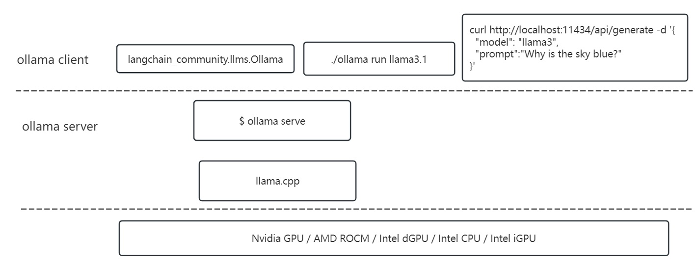

# Ollama 

## How to run Ollama server/client from source

```
$ git clone https://github.com/ollama/ollama.git
$ source intel/oneapi/setvars.sh

# Install go
$ wget https://go.dev/dl/go1.23.0.linux-amd64.tar.gz
$ mkdir ~/go_1.23.0 && tar zxf go1.23.0.linux-amd64.tar.gz -C ~/go_1.23.0
$ export PATH=$PATH:~/go_1.23.0/go/bin

$ cd ollama
$ go generate ./...
$ go build .    # ollama binary will be generated.

# Option to stop the before ollama service
$ ps -A |grep ollama
$ netstat -aon |grep 11434
$ sudo service ollama stop

# Start ollama server
$ OLLAMA_INTEL_GPU=1 ./ollama serve

# Start ollama client to test
# Option 1
$ ./ollama run llama3.1
# Option 2
$ curl --noproxy "localhost" http://localhost:11434/api/generate -d '{
  "model": "llama3.1",
  "prompt":"Why is the sky blue?"
}'
```

## Run Ollama server from the release
```
$ curl -fsSL https://ollama.com/install.sh | sh
# From the above install, ollama.service will be started. 
# Check /etc/systemd/system/ollama.service, and add proxy,
#    Environment="https_proxy=http://proxy.ims.intel.com:911"
# And restart as the below:
$ sudo systemctl daemon-reload
$ sudo systemctl restart ollama.service
```
Then run ollama client as the above.


## Code structure

* In gpu/gpu.go, it has the gpu discovery and priority, and server launch paramerters are set in llm/server.go
* Ollama will comiple all backends as much as possible according to the platform detection. CPU will definitely be compiled. If cuda/rocm/oneapi is detected, it will be compiled.



## Notes.
1. Ollama latest code has support Intel CPU, iGPU, dGPU. The commit is:    
    $ git show fd5971be0bb11d1b5903fc6778c329b4fd93d569    
2. The offical release https://ollama.com/install.sh has not supportted Intel GPU yet. Here has the personal [release](https://github.com/zhewang1-intc/ollama/releases) for Intel GPU.
3. Document is traced here.
