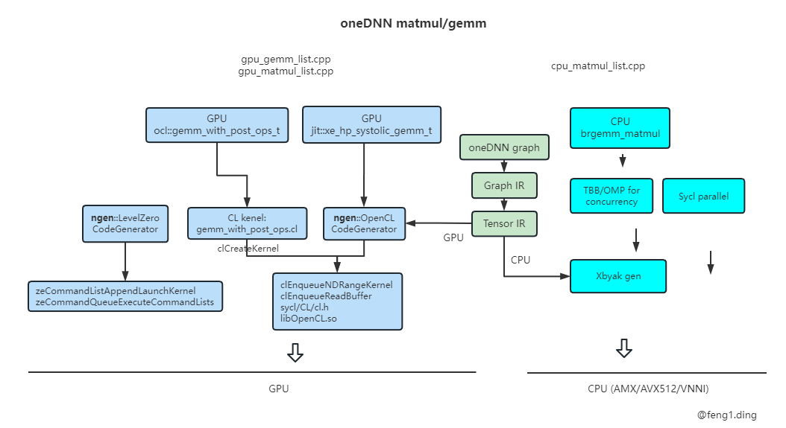

# TVM solution for Alibaba Xiaomanlv project


## tvm + onednn/gpu    
https://github.com/apache/tvm/pull/14231/files   
https://registry.khronos.org/SYCL/specs/sycl-2020/html/sycl-2020.html#_device_allocation_functions    

```
https://zhuanlan.zhihu.com/p/337033822
https://tvm.apache.org/2020/07/15/how-to-bring-your-own-codegen-to-tvm
python/tvm/relay/op/contrib/your_codegen_name.py  
./python/tvm/relay/op/contrib/dnnl.py
./tests/python/relay/test_pass_partition_graph.py
./tests/python/relay/test_json_runtime.py
./tests/python/relay/test_pass_merge_composite.py

./src/runtime/contrib/dnnl/
./src/relay/backend/contrib/dnnl/


We first register the codegen with TVM registration API   :
                       TVM_REGISTER_GLOBAL("relay.ext.dnnl").set_body_typed(DNNLCompiler);
Then we implement the entry function of the DNNL compiler 
                       runtime::Module DNNLCompiler
Then, we derive CSourceModuleCodegenBase to implement DNNLModuleCodegen 
                  class DNNLModuleCodegen : public CSourceModuleCodegenBase 
we only need to implement the DNNL code generation in the CreateCSourceModule function
                        runtime::Module CreateCSourceModule
Next, we implement GenDNNLFunc to generate the compilable C code with DNNL APIs as follows

the pre-implemented op-based DNNL functions are in src/runtime/contrib/dnnl/dnnl.cc

 the generated C code will be compiled when users call export_libray(mod)

tvm/cmake/modules/contrib/DNNL.cmake
```

## TVM + wmma (Tensor core)    

```
tvm 和 tensor core/wmma 怎么结合起来的 ？
https://tvm.apache.org/docs/how_to/work_with_schedules/tensorize.html  主要是用这个tensorize
如果opencl也可以直接对xmx编程，那么也可以通过tensorize集成到tvm中，最终让tvm支持xmx
```

## Joint-matirx    
joint-matrix -> sycl device front-end compiler -> LLVM IR -> spirv translator to llvm-spirv -> spirv joint matrix -> cpu backend AMX intrinsics / IGC backend XMX intrinsics    

## TVM + cudnn    
```
Cudnn
src/relay/backend/contrib/cudnn/target.cc
src/relay/backend/contrib/cudnn/
src/runtime/contrib/cudnn/*.cc

cmake/modules/CUDA.cmake

python/tvm/contrib/cudnn.py  -> def conv_forward   ？
python/tvm/relay/op/contrib/cudnn.py     ？

./python/tvm/topi/cuda/conv2d.py   -> cudnn.conv_forward

./tests/python/contrib/test_cudnn.py

tvm/tests/python/contrib/test_cudnn.py  -> verify_softmax() -> dev = tvm.cuda(0)    a = tvm.nd.array(a_np, dev)
```

## TVM tir
它是这样的过程， relay -> te -> tir -> opencl C code. 前面这里 relay -> te -> tir 基本和cuda一样。    
tir -> opencl C code 这步是怎么产生的 ？    
这是一个比较简单的过程，因为tir已经是比较低层的ir, 这里只要做简单的ir到C代码的翻译即可    

这些就是生成的tir, 对cuda和opencl是通用的， 已经和c代码十分类似了    

tvm 本身是支持opencl, 只要codegen的时候把target从'cuda'改成'opencl'即可，   
https://github.com/apache/tvm/tree/main/python/tvm/topi/adreno 这是针对adreno平台做的一些算子，   
tvm上也有针对优化卷积 https://github.com/apache/tvm/tree/main/python/tvm/topi/intel_graphics ，这些都是可以直接生成 opencl code的

## oneDNN tuning
onednn graph目前有两个backend，一个基于onednn primitives的，它的很多优化是基于heuristics的，不是tuning    
另一个backend是graph compiler backend，基于是类似tvm的methodology，有一定tuning的功能。   



## oneDNN graph
```
https://zhuanlan.zhihu.com/p/488384669
https://github.com/pytorch/pytorch/tree/master/torch/csrc/jit/codegen/onednn

oneDNN/src/backend/graph_compiler     compiler_backend.cpp  register_compiler_backend
两种JIT Engine：llvm_jit和c_jit    （DNNL_GRAPH_SC_CPU_JIT=llvm或c来设置JIT时使用的模式）
  Tensor IR -> llvm IR  再调用 LLVM 的 MCJIT 完成即时编译   （默认）
  Tensor IR -> C++ 源文件  再调用 g++ 编译为动态链接库，然后通过dlopen 加载生成的代码  （调试）

GraphCompiler runtime 提供一组支持函数，用于创建线程、分配文件、进行调试GraphCompiler生成的kernel 代码

Onednn example    e2ffeec0ee44595291cc1f6bc58e2b1a62806642 
https://github.com/oneapi-src/oneDNN/tree/dev-graph/doc
```
oneDNN graph compiler
```
MKN  8192, 8192, 8192
A 的一行 8192 个  float， 8192 x 4 = 32768 = 32 K 字节
我们将一个for循环拆解成两个for循环的变换称为split。如果交换两个嵌套的for循环，称之为reorder
我们在计算完matmul每个元素的结果后，可以马上计算relu，然后直接写入最终结果的矩阵中。这样，就让relu操作“融合”进入matmul中。可以省去重复读取内存的开销。实验发现这样的优化对于性能有巨大的影响。我们称这样的操作为“算子融合”，即fusion
oneDNN Graph API（我们简称oneDNN Graph）定义了大量DNN会用到的算子。在它的内部主要做的就是：接受用户输入的整个计算图，然后将图进行切分（partition），将被切分后的子图（partition）调度到不同的后端（backend）进行编译。在运行时，则是将数据根据计算图，导入到不同的可以执行的partition（compiled partition）中
oneDNN Graph的另一个后端，oneDNN Graph Compiler。它可以在更大的粒度下生成计算图的代码。由于Graph Compiler的能力理论上可以生成任意复杂的图连接关系，所有它可以相比oneDNN处理更大的子图。看到更大的子图，同时也意味着更多的优化机会

Graph IR是由Op（算子）和Logical Tensor组成
out=relu(matmul(a,b)) + a
graph(v0: f32[1024, 1024], v1: f32[1024, 1024]) -> [v2: f32[1024, 1024]] {
  [v3: f32[1024, 1024]] = matmul_core(v0, v1)
  [v4: f32[1024, 1024]] = relu(v3)
  [v2: f32[1024, 1024]] = add(v4, v0)
}

V0, v1 输入， V2 输出
bool add__1(float __outs_0[1024UL * 1024UL], float __ins_0[1024UL * 1024UL], float __ins_1[1024UL * 1024UL]) {
  #pragma omp parallel for
  for (int _fuseiter0 = 0; _fuseiter0 < 1024UL; _fuseiter0 += 1) {
    for (int _fuseiter1 = 0; _fuseiter1 < 1024UL; _fuseiter1 += 1) {
        __outs_0[_fuseiter0*1024 + _fuseiter1] = (__ins_0[_fuseiter0*1024 + _fuseiter1] + __ins_1[_fuseiter0*1024 + _fuseiter1]);
    }
  }
  return true
}
Meta programming
func add__1(__outs_0: [f32 * 1024UL * 1024UL], __ins_0: [f32 * 1024UL * 1024UL], __ins_1: [f32 * 1024UL * 1024UL]): bool {
  for _fuseiter0 in (0, 1024UL, 1) parallel {
    for _fuseiter1 in (0, 1024, 1) {
        __outs_0[_fuseiter0, _fuseiter1] = (__ins_0[_fuseiter0, _fuseiter1] + __ins_1[_fuseiter0, _fuseiter1])
    }
  }
  return true
}
```

```
OneDNN GraphCompiler接收到的是基于oneDNN Graph API的计算子图（partition），然后 GraphCompiler 与 oneDNN Graph 桥接代码会把这个 partition 翻译为GraphCompiler 内部的图表示形式，即上一节说的Graph IR
在得到Graph IR之后，GraphCompiler会有一系列的pass用来处理和优化Graph IR。这里的Pass也是编译器中常见的概念，即对IR进行分析和变换的子程序。通常一个Pass会对IR产生一种优化，而我们把一系列的pass组合起来，依次调用，就能对IR进行各种不同的优化了。
接下来的一个模块是Graph Lowering，这是Graph IR上的最后一个pass，将Graph IR转换为更为底层的Tensor IR。对于每一个Op，我们都为其实现了IR的模板，确定具体输入输出Tensor形状和其他配置之后，我们可以为Op生成对应的底层Tensor IR。
然后在Tensor IR层面，我们也实现了一套优化pass pipeline，经过pipeline之后的Tensor IR已经被优化完毕，并且适合被用来生成机器码了

JIT，Just-in-time 即时编译，即在程序运行的时候动态生成机器汇编码来运行用户需要的程序
AOT，即Ahead-of-time，即在程序开始运行之前就编译程序到汇编指令
GraphCompiler目前开源了两种JIT Engine：llvm_jit和c_jit
在 llvm_jit 中，我们将 Tensor IR 翻译为 LLVM IR，然后调用 LLVM 的 MCJIT 完成即时编译。
在 c_jit 中，我们把 Tensor IR 翻译为 C++ 源文件，然后调用g++编译为动态链接库，然后通过dlopen加载生成的代码


GraphCompiler提供的Runtime： 在GraphCompiler生成的代码（我们通常称之为Kernel）运行的时候，需要提供一组支持函数，用于创建线程、分配文件、进行调试等等
```

```
Code stack:

pass::pass_manager_t   get_passes

tests/cpp/unit/backend/graph_compiler
oneDNN/src/backend/graph_compiler/patterns/transformation_pattern.hpp
COMPILER_BACKEND_REGISTER_TRANSFORMATION_PASS  registry.register_pass(transformation_pass_t::create)

tests/cpp/unit/backend/dnnl
oneDNN/src/backend/dnnl/patterns/transformation_pattern.hpp
DNNL_BACKEND_REGISTER_TRANSFORMATION_PATTERN  registry.register_pass(transformation_pass_t::create)

impl::partition_t
impl::compiled_partition_t
    init()
    compile()
    execute()
    query_logical_tensor()

class transformation_pass_t : public impl::pass::pass_base {
   run() {
       pu.set_partitions
   }
}
src/backend/graph_compiler/patterns/pattern_utils.hpp
    pattern_utils_t::set_partitions()
             src/backend/graph_compiler/compiler_partition_impl.cpp  -> compiler_partition_impl_t::compile()

Ch3-HelloCompiler  https://zhuanlan.zhihu.com/p/492648344

GraphCompiler通过context来存储编译器本身的配置，例如目标CPU支持的指令集等等

Tensor IR：  1. 类似C语言的表达能力， 2. 通过C++对象存储， 3. 一个 tensor IR 函数可以认为是一棵C++ IR对象的树，通过对 IR 的变换来优化 IR 代码
Expr   表达式， sc_data_type_t, expr_base,   add_node, binary_node,   
Tensor IR中的节点通过拓展expr_base类型的子类来定义各种运算。而每个运算的操作数通过子类的成员变量保存指向操作数expr_base的指针。这样通过遍历一颗expr的“树”，可以得到一个表达式的所有组成部分.
Stmt  statement  类别 if, for 控制流，赋值语句.   Stmt_base_t  没有返回值
IR function， 即用 expr stmt 搭建出来的 Tensor IR 函数， 有全局变量
IR module 是由多个 IR function 组成的集合
如果将一个Tensor IR function比喻为一个“人”，那么Stmt是“骨架”，通过stmts和控制流搭起整个IR的运算流程，而Expr是“血肉”，基于Stmt的骨架表示实际的运算

Graph IR   有向无环图 DAG
    tensor 和 tensor IR 中的 tensor 不同， 还要记录 op 连接关系，所有者
   shape 两种：  logical dims 或称 plain dims，  内存中的 real dims 或称 blocking dims
Tvm/graphcompiler 称之为 reorder， onednn 称为 prepack
和GraphIR的Tensor不同，Tensor IR中的Tensor只需要记录real dims，而logical dims一般不会被记录进Tensor IR中的Tensor中
   OP， tensor， Graph
遍历 graph 中所有 Op：  在GraphCompiler中，有大量代码需要遍历图中所有的Op，包括大部分Graph IR pass，将Graph打印为字符串的print_graph函数等等
DFS  深度优先， BFS 广度优先， 拓扑排序，因为Op的input tensor需要先于Op被计算出来


Graph lowering   反过来叫 lifting
Graph IR:  graph, op, tensor, format
Tensor IR:  IR module, function, tensor
Graph IR中的Tensor对应于Tensor IR中的tensor。Tensor IR中tensor_node更接近于计算机底层指针的概念，表示一块内存上的多维有序空间。Graph Tensor中有format的概念，表示了tensor的实际内存排布。而在Tensor IR中，已经没有format的概念了，而是直接细化到访问Tensor的IR代码中
打分选择OP： 一个Op的“好坏”大致是它“解放”的input tensor大小（如果这个Op是最后一个使用某Tensor的Op，那么此后这个Tensor可以马上释放），减去这个Op“生成”的Tensor大小，即它的输出Tensor的总大小。如果“解放”的Tensor大小远远大于“生成”Tensor的大小，那么认为它是好的   https://zhuanlan.zhihu.com/p/516573336
```
```
所有的graph pass都是C++函数。 
接收一个graph对象，直接（inplace）在graph对象上进行修改   https://zhuanlan.zhihu.com/p/538405247 
Tensor IR pass的顶层接口是module_pass_t对象。这是个虚基类

编译运行  https://zhuanlan.zhihu.com/p/550602254
JIT编译“正好”发生在用户运行想要执行的程序之前，而AOT则是预先将程序编译为可执行的代码。
Graph Compiler选用了JIT模式。主要原因在于，Pytorch Tensorflow这类框架的用户可以任意指定Tensor的shape，以及计算图的连接。我们作为底层编译器，不可能为所有的输入Tensor大小预先编译代码。并且Graph Compiler在知道计算图之后才能为这个图进行算子融合，生成优化后的代码。所以在用户输入计算图之后再进行编译是通常情况下最好的选择
Cfake_jit 和 llvm_jit 都继承了  jit_engine_t
Jit.hpp  make_jit_module   接收  tensor IR module,  输出为 编译后的 JIT module，指向可执行的二级制代码。 
make_jit_module然后对优化后的Tensor IR经过代码生成（codegen）转换为可执行代码，最终返回内存中管理可执行代码的C++对象：jit_module
JIT module类是JIT编译器的编译结果，是编译后的可执行函数代码、以及代码依赖的全局变量的集合。JIT module中的各个元素和IR module中的一一对应，IR中的每个IR function和global tensor、variable都会分别被编译进IR module中的代码部分和数据部分
由于不同的JIT方式管理生成的代码和在代码中提取想要的函数指针的方式都不尽相同，所以JIT Module和JIT Engine一样也是一个虚基类，不同的JIT编译器会创建不同的JIT Module子类对象。
JIT Module包含了同一个模块中被编译的多个函数，那么如何从JIT Module中选择某个函数来执行呢？我们看到这个类中提供了get_function接口，输入是函数的名字，输出则是函数对象的指针。通常一个IR module会有一个“主函数”
通过类jit_function_t来表示一个编译后的可执行函数。  call_generic  用户在调用JIT function的时候需要先将参数列表存入一个数组中，然后将数组指针传入call_generic的第二个参数
用户通过JIT编译器来执行Tensor IR的流程：首先需要创建一个JIT Engine实例，然后调用make_jit_module生成JIT module，并且从JIT Module中通过get_function方法得到JIT function。最终，调用call_generic方法调用生成的函数。用户也可以直接将IR module交给JIT engine的get_entry_func函数，直接得到“主函数”的JIT function

```
LLVM jit engine
```
LLVM 的 jit engine
LLVM 自带 JIT 编译功能。 LLVM jit 利用 LLVM 来完成 tensor IR 到 可执行代码的转换。   Tensor IR -> LLVM IR 再调用 JIT 完成编译 https://link.zhihu.com/?target=https%3A//github.com/oneapi-src/oneDNN/blob/dev-graph/src/backend/graph_compiler/core/src/compiler/jit/llvm/llvm_jit.cpp
llvm_jit::make_jit_module中，Graph Compiler首先调用Tensor IR pass——llvm_generator_pass来将Tensor IR转换为LLVM IR，并且提取出Tensor IR用到的静态全局变量，放入statics_table中。然后它将调用llvm的Execution Engine（MCJIT）生成内存中的可执行代码。最终将Execution Engine和statics_table放入Graph Compiler的llvm_jit_module中。
LLVM_generator_pass   https://link.zhihu.com/?target=https%3A//github.com/oneapi-src/oneDNN/blob/dev-graph/src/backend/graph_compiler/core/src/compiler/codegen/codegen_llvm.cpp   
这个pass首先调用了precodegen_passes（我们在之前的这篇文章中已经讨论了这个Tensor IR pipeline），对输入的未经规整化和优化的Tensor IR进行处理和优化，然后将优化后的Tensor IR交给codegen_llvm_vis_t这个Tensor IR viewer（详见这篇文章对IR viewer的描述）来遍历整个IR module中的所有函数，逐一将每个Tensor IR节点翻译为LLVM IR节点 (通过 codegen_llvm_vis_t->builder_)
在有些场景下，用户可能希望Graph Compiler将编译的结果保存到文件，而不是JIT直接运行。这就相当于我们之前说的AOT编译模式。Graph Compiler中，我们只要手动调用llvm_generator_pass（而不是直接调用llvm jit），就可以从Tensor IR得到LLVM IR，用户代码中可以选择保存LLVM IR或者是将它进一步转换为Object file（LLVM提供了相应的功能）。这样就可以通过手动调用的方式实现AOT编译模式
```

oneDNN jit
```
[12/19 13:07] Ding, Feng1
请教一下   onednn jit 的  gencode ，  和 你们做的  graph compiler 最后 gencode， 是不是一个东西 ？ 
[12/19 13:07] Mei, Yijie
不是的,
我们codegen主力用的LLVM
我们有两个codegen backend，LLVM和builtin
LLVM性能更好，builtin还在开发当中，性能大概能到LLVM的80-90%
builtin和onednn共享一套汇编生成器，仅此而已
但是如何生成汇编，寄存器分配，都是不一样的

LLVM IR 之后还有backend 针对 device 的编译优化吧，  这部分在JIT 过程中是怎么做的 ？
针对device的优化就交给LLVM本身了
我们除了LLVM还有另外一个backend，是我们自己写的，这个会做一点底层的优化， xbyak（builtin）backend，这个里面我们做了基于SSA的优化，还有寄存器分配

xbyak 这部分code/example 在哪？
这就是在JIT的时候选不同的JIT engine就行了，有个环境变量可以选择不同的JIT，DNNL_GRAPH_SC_CPU_JIT={llvm,c,builtin}

这个 “builtin和onednn共享一套汇编生成器“ 是怎么做到的 
就是共用了xbyak这个第三方库，你call它里面的mov()函数，就生成一个mov指令
builtin JIT的部分在src/compiler/jit/xbyak
src/gpu/jit/gemm/gen_gemm_kernel_generator.cpp     : 16707  gemm_kernel_generator_t<hw>::gemm()   这个就是 jit::gen_gemm_t  产生code 的地方  是吧  

https://github.com/oneapi-src/oneDNN/blob/master/src/cpu/README.md
目前，唯一的体系结构特定目录cpu/x64包含 Intel 64 / AMD64 实现，主要使用 JIT 汇编器 Xbyak来生成高度优化的代码。
https://github.com/herumi/xbyak   kai bia ku
支持的编译器:   几乎适用于 x86/x64 的 C++03 或更高版本的编译器，例如 Visual Studio、g++、clang++、Intel C++ 编译器和 mingw/cygwin 上的 g++
Xbyak 是一个 C++ 的 Header-Only 的汇编库，能够直接将可执行的二进制代码生成在内存中，并将其标记为可执行。使得程序课题通过比如函数调用等方式跳转到生成的代码中执行，达到 JIT 的目的。
这个库使用非常简单，单纯地将一个头文件 include 进来即可。这个库提供了一个 Xbyak::CodeGenerator 类，就是用来生成和管理二进制代码的类。这个类提供了一系列公有方法和公有成员变量，使得用户可以非常方便地像真的在写汇编一样动态生成代码
```

## oneDNN code trace
```
gdb -args build/examples/primitives-softmax-cpp gpu
b verbose.cpp:951

Create
/home/fengding/github/oneDNN/examples/primitives/softmax.cpp      
         softmax_forward()
/home/fengding/github/oneDNN/include/oneapi/dnnl/dnnl.hpp: 6745, 12447, 12431   声明了所有的 primitive
	softmax_forward()
	
	primitive::primitive() -> dnnl_primitive_create()
/home/fengding/github/oneDNN/src/common/primitive_iface.cpp:147, 78
	dnnl::impl::primitive_create
	Create 的打印是在这里 line78
	printf("onednn_verbose%s,create:%s,%s,%g\n", stamp.c_str(), str, p_iface.first->pd()->info(), duration_ms);
/home/fengding/github/oneDNN/src/common/primitive_desc.hpp:66
/home/fengding/github/oneDNN/src/common/verbose.cpp:995
	init_info_softmax(const engine_t *e, const pd_t *pd)

Execute
/home/fengding/github/oneDNN/examples/primitives/softmax.cpp
	softmax_prim.execute()
/home/fengding/github/oneDNN/include/oneapi/dnnl/dnnl.hpp:12459
     dnnl_primitive_execute()
/home/fengding/github/oneDNN/src/common/primitive_iface.cpp:194, 89
          dnnl::impl::primitive_execute()
    stream->enqueue_primitive()
	Exec 的打印在这里 line 109
	printf("onednn_verbose%s,exec,%s,%g\n", stamp.c_str(), primitive_iface->pd()->info(), duration_ms);


	5. runtime
/usr/lib/x86_64-linux-gnu/libze_loader.so.1

cb is compute block


Src/sycl/level_zero_utils.cpp
sycl_create_kernel_with_level_zero


/home/fengding/github/oneDNN/src/common/primitive_iface.cpp:147
	dnnl_primitive_create(primitive_iface_t **primitive_iface, const primitive_desc_iface_t *primitive_desc_iface)
	dnnl::impl::primitive_create(primitive_iface, primitive_desc_iface);
	

	/home/fengding/github/oneDNN/src/common/primitive_iface.cpp:68
		primitive_desc_iface->create_primitive_iface(p_iface, cache_blob)
		
	
	/home/fengding/github/oneDNN/src/common/primitive_desc_iface.cpp:97
		dnnl_primitive_desc::create_primitive_iface
	
	/home/fengding/github/oneDNN/src/common/primitive.hpp:133, 54
		create_primitive_common()
		p->init()  如果 cache 里没有
		init_cached_resource
		
	/home/fengding/github/oneDNN/src/gpu/gpu_primitive.hpp:66,224
		fill_mapper  -> cb.kernel().realize(compute::kernel_t realized_kernel)
	
	/home/fengding/github/oneDNN/src/gpu/compute/kernel.hpp:133
		impl_->realize(kernel, engine, programs)
	
	/home/fengding/github/oneDNN/src/gpu/sycl/sycl_interop_gpu_kernel.cpp:79
		sycl_interop_gpu_kernel_t::realize() -> sycl_create_kernel_with_level_zero()
		
	/home/fengding/github/oneDNN/src/sycl/level_zero_utils.cpp:173
		/home/fengding/github/oneDNN/src/sycl/sycl_compat.cpp :184
		func_zeKernelCreate(ze_module, &ze_kernel_desc, &ze_kernel)
		print((ze_kernel_desc_t)ze_kernel_desc)
		$12 = {stype = ZE_STRUCTURE_TYPE_KERNEL_DESC, pNext = 0x0, flags = 0, pKernelName = 0x555555d85e90 "ref_softmax_fwd_generic"}
	
		###################################################################
	/home/fengding/github/oneDNN/src/common/primitive_iface.cpp:68
		dnnl::impl::primitive_create
	/home/fengding/github/oneDNN/src/common/primitive_desc_iface.cpp:97
		dnnl_primitive_desc::create_primitive_iface
		   这里怎么能直接调到 ref_softmax 呢？
		  const std::shared_ptr<primitive_desc_t> &dnnl_primitive_desc::impl() const {
		    return pd_;  这里返回了这个   看  pd_ 怎么初始化的, 就是在 example softmax_forward::primitive_desc 中创建，传给了父类 primitive 并一路传下来的，
		        那 softmax_accurate 和  ref_softmax_fwd_t() 怎么联系起来的？是通过 DECLARE_COMMON_PD_T， no
		 
		   }
		   在 example softmax.cpp 中  
		      auto softmax_pd = softmax_forward::primitive_desc(engine,
		            prop_kind::forward_training, algorithm::softmax_accurate, src_md,
		            dst_md, axis);
		      softmax_accurate 指定了是哪个算子，保存在 pd 中
		      softmax_forward : public primitive {}  定义在 dnnl.hpp 中， 这是个 外部的头文件
		      auto softmax_prim = softmax_forward(softmax_pd);  调用了一下构造函数， 它继承了 primitive 类， 所以
		
		
		dnnl_primitive_desc
		
	/home/fengding/github/oneDNN/src/gpu/ocl/ref_softmax.hpp:41
		dnnl::impl::gpu::ocl::ref_softmax_fwd_t::pd_t::create_primitive
	/home/fengding/github/oneDNN/src/common/primitive.hpp:133
		dnnl::impl::primitive_t::create_primitive_common
	/home/fengding/github/oneDNN/src/common/primitive.hpp:53
		dnnl::impl::primitive_t::init
	/home/fengding/github/oneDNN/src/gpu/ocl/ref_softmax.hpp:148
		dnnl::impl::gpu::ocl::ref_softmax_fwd_t::init
		create_kernel(engine, &kernel_, "ref_softmax_fwd_generic", kernel_ctx);
	
	6. Softmax kernel

src/gpu/ocl/ref_softmax.cpp
create_kernel(engine, &kernel_, "ref_softmax_fwd_generic", kernel_ctx);
./src/gpu/ocl/ref_softmax.cl:ref_softmax_fwd_generic()
./src/gpu/ocl/ref_softmax.cl:ref_softmax_bwd_generic()
./src/gpu/ocl/ocl_gpu_engine.cpp:status_t ocl_gpu_engine_t::create_kernels()  通过 kernel name 找到 cl 的实现
ocl::create_kernels(this, kernel_list, kernel_ctx)

./gpu/ocl/ref_softmax.hpp 
      DECLARE_COMMON_PD_T("ref:any", ref_softmax_fwd_t);    实现的类型 ref:any，  
                    定义在  primitive_desc.hpp  DECLARE_COMMON_PD_t
                primitive_t::create_primitive_common()
     create_kernel(engine, &kernel_, "ref_softmax_fwd_generic", kernel_ctx); 通过 kernel name 找到 ocl 的实现   ./src/gpu/ocl/ref_softmax.cl:ref_softmax_fwd_generic(）


	7.  softmax_accurate 和  ref_softmax_fwd_t() 怎么联系起来的？
	
/home/fengding/github/oneDNN/examples/primitives/softmax.cpp:89
	softmax_prim = softmax_forward(softmax_pd);
/home/fengding/github/oneDNN/include/oneapi/dnnl/dnnl.hpp:6745， 12447， 12431
/home/fengding/github/oneDNN/src/common/primitive_iface.cpp:147
/home/fengding/github/oneDNN/src/common/primitive_iface.cpp:81
/home/fengding/github/oneDNN/src/common/primitive_desc_iface.cpp:97
/home/fengding/github/oneDNN/src/gpu/ocl/ref_softmax.hpp:41   就直接调到ref_softmax_fwd_t实现了

/home/fengding/github/oneDNN/examples/primitives/softmax.cpp:84
	auto softmax_pd = softmax_forward::primitive_desc(engine,
            prop_kind::forward_training, algorithm::softmax_accurate, src_md,
            dst_md, axis);
      在创建 pd 的时候就建立了 softmax 具体实现 ref_softmax_fwd_t 的联系
/home/fengding/github/oneDNN/include/oneapi/dnnl/dnnl.hpp:6700
/home/fengding/github/oneDNN/src/common/softmax.cpp:90
/home/fengding/github/oneDNN/src/common/primitive_desc_iface.cpp:46
/home/fengding/github/oneDNN/src/common/primitive_desc_iface.cpp:67
/home/fengding/github/oneDNN/src/common/primitive_desc_iterator.hpp:52
/home/fengding/github/oneDNN/src/gpu/sycl/sycl_gpu_engine.hpp:70
/home/fengding/github/oneDNN/src/gpu/gpu_impl_list.cpp:48   
         get_implementation_list() -> get_softmax_impl_list()
/home/fengding/github/oneDNN/src/gpu/gpu_softmax_list.cpp:50

	8. Execute

/home/fengding/github/oneDNN/examples/primitives/softmax.cpp:97
	softmax_prim.execute(engine_stream, softmax_args);
/home/fengding/github/oneDNN/include/oneapi/dnnl/dnnl.hpp:12459
/home/fengding/github/oneDNN/src/common/primitive_iface.cpp:194, 103
/home/fengding/github/oneDNN/src/gpu/ocl/ref_softmax.hpp:155
/home/fengding/github/oneDNN/src/gpu/ocl/ref_softmax.cpp:40
/home/fengding/github/oneDNN/src/gpu/gpu_primitive.hpp:208
/home/fengding/github/oneDNN/src/gpu/gpu_primitive.hpp:242
/home/fengding/github/oneDNN/src/gpu/compute/compute_stream.hpp:45
/home/fengding/github/oneDNN/src/gpu/compute/kernel.hpp:124
/home/fengding/github/oneDNN/src/gpu/sycl/sycl_interop_gpu_kernel.cpp:116


sycl_interop_gpu_kernel_t::parallel_for(stream_t &stream,
        const gpu::compute::nd_range_t &range,
        const gpu::compute::kernel_arg_list_t &arg_list) {
	…
	queue.submit([&](::sycl::handler &cgh)
	…
}
  include/sycl/CL/sycl/detail/common.hpp:60
     include/sycl/CL/sycl/queue.hpp:275
    include/sycl/CL/sycl/event.hpp:31

	9. Sycl 和 level zero
onednn 实现的 op kernel 是通过 level zero func_zeModuleCreate 创建的
op execute 执行是 通过 queue.submit([&](::sycl::handler &cgh)
这两者是什么关系，具体都做了什么？
GPU default 的JIT compiler。 SYCL的代码是spirv的中间代码。 zeModuleCreate 会调用Level zero编译spriv 代码，得到GPU代码
queue.submit 是sycl 代码： sycl kernel 在GPU上会调用level zero  API来实现 ：  kernel create， setArgument，launchKernel 这些
Intel LLVM 里 有  level zero 和 opencl backend
Llvm/sycl/source/backend/
     level_zero.cpp      opencl.cpp
使用 ze_tracer 可以打印出 level zero 的调用，还有时间统计
/home/fengding/github/pti-gpu/tools/ze_tracer/build/ze_tracer -c -h  ./primitives-matmul-cpp gpu
C:\workspace\oneDNN   ze_tracer_print.txt
######## Create primitive descriptor
######## Create primitive
######## before func_zeModuleCreate
>>>> [679546132] zeModuleCreate: hContext = 0x5615cdd0c730 hDevice = 0x5615cda528a0 desc = 0x7ffd25d587c8 {ZE_STRUCTURE_TYPE_MODULE_DESC(0x1b) 0 1 58200 0x5615ceb6fc20  0} phModule = 0x7ffd25d587c0 (hModule = 0) phBuildLog = 0
<<<< [679707326] zeModuleCreate [151786 ns] hModule = 0x5615cdd23790 -> ZE_RESULT_SUCCESS(0x0)
######## end func_zeModuleCreate
######## before func_zeKernelCreate
>>>> [679738805] zeKernelCreate: hModule = 0x5615cdd23790 desc = 0x7ffd25d58690 {ZE_STRUCTURE_TYPE_KERNEL_DESC(0x1d) 0 0 "ref_softmax_fwd_generic"} phKernel = 0x7ffd25d586b0 (hKernel = 0x7ffd25d58830)
<<<< [679873778] zeKernelCreate [131511 ns] hKernel = 0x5615cfbae250 -> ZE_RESULT_SUCCESS(0x0)
######## end func_zeKernelCreate
>>>> [679894607] zeKernelSetIndirectAccess: hKernel = 0x5615cfbae250 flags = 7
<<<< [679898842] zeKernelSetIndirectAccess [442 ns] -> ZE_RESULT_SUCCESS(0x0)
######## softmax primitive execute
######## before queue.submit
>>>> [679997132] zeKernelGetName: hKernel = 0x5615cfbae250 pSize = 0x7ffd25d56fc8 pName = 0
<<<< [680000542] zeKernelGetName [469 ns] Size = 24 -> ZE_RESULT_SUCCESS(0x0)
>>>> [680005049] zeKernelGetName: hKernel = 0x5615cfbae250 pSize = 0x7ffd25d56fc8 pName = 0x5615cdd0f920
<<<< [680008481] zeKernelGetName [267 ns] Size = 24 Name = "ref_softmax_fwd_generic" -> ZE_RESULT_SUCCESS(0x0)
>>>> [680020805] zeKernelSetArgumentValue: hKernel = 0x5615cfbae250 argIndex = 0 argSize = 8 pArgValue = 0x5615ce526be0
<<<< [680026462] zeKernelSetArgumentValue [3199 ns] -> ZE_RESULT_SUCCESS(0x0)
>>>> [680030785] zeKernelSetArgumentValue: hKernel = 0x5615cfbae250 argIndex = 1 argSize = 8 pArgValue = 0x5615ce3692f0
<<<< [680033326] zeKernelSetArgumentValue [356 ns] -> ZE_RESULT_SUCCESS(0x0)
>>>> [680037189] zeKernelSetArgumentValue: hKernel = 0x5615cfbae250 argIndex = 2 argSize = 8 pArgValue = 0
<<<< [680039302] zeKernelSetArgumentValue [145 ns] -> ZE_RESULT_SUCCESS(0x0)
>>>> [680042422] zeKernelSetArgumentValue: hKernel = 0x5615cfbae250 argIndex = 3 argSize = 8 pArgValue = 0
<<<< [680043628] zeKernelSetArgumentValue [62 ns] -> ZE_RESULT_SUCCESS(0x0)
>>>> [680049377] zeKernelSetGroupSize: hKernel = 0x5615cfbae250 groupSizeX = 32 groupSizeY = 1 groupSizeZ = 1
<<<< [680052228] zeKernelSetGroupSize [602 ns] -> ZE_RESULT_SUCCESS(0x0)
>>>> [680059060] zeCommandQueueCreate: hContext = 0x5615cdd0c730 hDevice = 0x5615cda528a0 desc = 0x7ffd25d56370 {ZE_STRUCTURE_TYPE_COMMAND_QUEUE_DESC(0xe) 0 0 0 0 2 0} phCommandQueue = 0x5615ce224290 (hCommandQueue = 0)
<<<< [680084757] zeCommandQueueCreate [22350 ns] hCommandQueue = 0x5615cfbaf340 -> ZE_RESULT_SUCCESS(0x0)
>>>> [680089491] zeCommandListCreate: hContext = 0x5615cdd0c730 hDevice = 0x5615cda528a0 desc = 0x7ffd25d56420 {ZE_STRUCTURE_TYPE_COMMAND_LIST_DESC(0xf) 0 0 0} phCommandList = 0x7ffd25d56448 (hCommandList = 0x7fded686caaa)
<<<< [680340973] zeCommandListCreate [248451 ns] hCommandList = 0x5615ce337730 -> ZE_RESULT_SUCCESS(0x0)
>>>> [680347100] zeFenceCreate: hCommandQueue = 0x5615cfbaf340 desc = 0x7ffd25d56450 {ZE_STRUCTURE_TYPE_FENCE_DESC(0x12) 0 0} phFence = 0x7ffd25d56468 (hFence = 0x5615cda776e0)
<<<< [680350687] zeFenceCreate [760 ns] hFence = 0x5615ce0df600 -> ZE_RESULT_SUCCESS(0x0)
>>>> [680356831] zeCommandListAppendLaunchKernel: hCommandList = 0x5615ce337730 hKernel = 0x5615cfbae250 (ref_softmax_fwd_generic) pLaunchFuncArgs = 0x7ffd25d566d0 {3, 1, 1} hSignalEvent = 0x5615cdd7b420 numWaitEvents = 0 phWaitEvents = 0
<<<< [680375536] zeCommandListAppendLaunchKernel [9272 ns] -> ZE_RESULT_SUCCESS(0x0)
>>>> [680381608] zeCommandListClose: hCommandList = 0x5615ce337730
<<<< [680384648] zeCommandListClose [935 ns] -> ZE_RESULT_SUCCESS(0x0)
>>>> [680388921] zeCommandQueueExecuteCommandLists: hCommandQueue = 0x5615cfbaf340 numCommandLists = 1 phCommandLists = 0x7ffd25d56550 (hCommandLists = 0x5615ce337730) hFence = 0x5615ce0df600
<<<< [680538715] zeCommandQueueExecuteCommandLists [147351 ns] hCommandLists = 0x5615ce337730 -> ZE_RESULT_SUCCESS(0x0)
######## end queue.submit
######## end of  primitive execute


	10. 总结顺序
######## Create primitive descriptor
oneDNN/src/gpu/gpu_softmax_list.cpp:49
dnnl::impl::gpu::get_softmax_impl_list

######## Create primitive
ref_softmax.hpp:37
create_kernel(engine, &kernel_, "ref_softmax_fwd_generic", kernel_ctx); 通过 kernel name 找到 ocl 的实现  ./src/gpu/ocl/ref_softmax.cl:ref_softmax_fwd_generic(
oneDNN/src/sycl/level_zero_utils.cpp:178
func_zeModuleCreate(ze_ctx, ze_device, &desc, &ze_module, nullptr)
func_zeKernelCreate(ze_module, &ze_kernel_desc, &ze_kernel)

######## softmax primitive execute
######## before queue.submit
######## end queue.submit
######## end of  primitive execute

	11. 和 jit 相关的
Kernel name:   gemm_kernel
/home/fengding/github/oneDNN/src/gpu/jit/gemm/gen_gemm_kernel.cpp:545
/home/fengding/github/oneDNN/src/gpu/jit/gemm/gen_gemm_kernel_generator.hpp:1368
/home/fengding/github/oneDNN/src/gpu/jit/jit_generator.hpp:130
/home/fengding/github/oneDNN/src/gpu/jit/ngen/ngen_opencl.hpp:52
/home/fengding/github/oneDNN/src/gpu/jit/ngen/ngen_elf.hpp:36

/home/fengding/github/oneDNN/src/gpu/jit/ngen/ngen_interface.hpp:150
../sysdeps/x86_64/multiarch/strlen-avx2.S:42

/home/fengding/github/oneDNN/src/gpu/jit/ngen/ngen_core.hpp:913
/home/fengding/github/oneDNN/src/gpu/jit/ngen/ngen_core.hpp:912
/home/fengding/github/oneDNN/src/gpu/jit/ngen/ngen_interface.hpp:171
/home/fengding/github/oneDNN/src/gpu/jit/jit_generator_base.hpp:28
/home/fengding/github/oneDNN/src/gpu/jit/gemm/gen_gemm_kernel_generator.hpp:1398
/home/fengding/github/oneDNN/src/gpu/jit/gemm/gen_gemm_kernel_generator.hpp:795
/home/fengding/github/oneDNN/src/gpu/ocl/ocl_utils.hpp:206


ref_convolution_fwd

gpu_convolution_list.cpp
ref_convolution.hpp   
        create_kernel(engine, &kernel_, "ref_convolution_fwd", kernel_ctx);
        ref_convolution.cl
```
