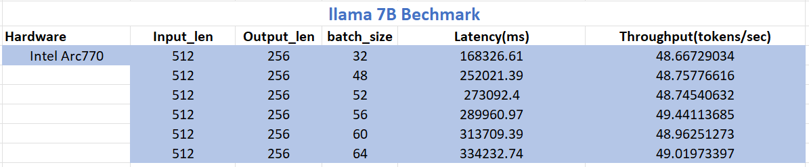

# vllm

## Env
on ARC770    
python3.10    
oneapi 2024.0

## Setup
```
$ git clone https://github.com/jikunshang/vllm.git
$ cd vllm
$ git checkout origin/dpct_dev_0124 -b dpct-dev_0124
$ pip install -r requirements-xpu.txt
$ pip install --no-deps xformers
$ source /opt/intel/oneapi/setvars.sh  ## oneapi 2024.0
$ VLLM_BUILD_XPU_OPS=1 pip install --no-build-isolation -v -e .
```

## Verify
```
$ pip install pytest
$ pytest tests/kernels/test_attention.py::test_paged_attention_xpu
```

## Benchmark
Get llama 7B model: https://huggingface.co/huggyllama/llama-7b

### benchmark_latency.py
```
# Change your model dir and batch-size
$ python3 benchmarks/benchmark_latency.py --model=/home/fengding/llama-7b-hf/  --input-len=512 --output-len=256 --batch-size=32  --dtype=float16  --device=xpu --enforce-eager
```



### benchmark_throughput.py
```
$ git clone https://huggingface.co/datasets/anon8231489123/ShareGPT_Vicuna_unfiltered
# Change your dataset, model and num-prompt
$ python3 benchmarks/benchmark_throughput.py --backend=vllm --dataset=/home/fengding/github/ShareGPT_Vicuna_unfiltered/ShareGPT_V3_unfiltered_cleaned_split.json  --model=/home/fengding/llama-7b-hf --num-prompts=100 --trust-remote-code --device=xpu  --dtype=float16
```
> Throughput: 0.25 requests/s, 120.69 tokens/s

### Run llama 7B and Qwen 7B
Get models.    
llama 7B  : https://huggingface.co/huggyllama/llama-7b    
Qwen 7B:   https://huggingface.co/Qwen/Qwen-7B-Chat    

```
# Change examples/offline_inference.py 
    -llm = LLM(model="facebook/opt-125m")
    +llm = LLM(model="/home/fengding/llama-7b-hf", device="xpu", enforce_eager=True)
$ python3 examples/offline_inference.py
```
